# Human Computer Interaction
Human-Computer Interaction is a field of study on designing, implementing, and evaluating interactive computing systems for human use, and it is also concerned with the major phenomena surrounding them. Recently, HCI has drawn lots of attention from software industry and various research labs for its practical applications and commercial merits. There are many computing systems that are fancy looking and computationally efficient, but often they are not practically efficient even though they are implemented exactly following the software specification. Most of those failures are due to the fact that software designers overlook the golden rule of HCI, that is to know the user.  In this course, we will learn the fundamental components and practical techniques of HCI. We will start with studying designs of everyday objects to motivate the efficient design of interactive computing systems. Then, we will learn HCI theories and techniques on how to involve users in designing and evaluating interactive computing systems. We will apply them in our class projects to solidify our HCI knowledge. In doing so, we can go beyond the conventional perception that HCI is just about a set of techniques for building graphically appealing user interfaces.

Term Project (group of two students): Each student should perform a class project on an interactive (graphical) user interface design. The project theme will be announced in the first week of the class.

Readings: There will be several reading assignments and occasional other exercises.

Hall of Fame/Shame presentation: Each student will have to choose an interface to analyze it from the standpoint of HCI. At the beginning of each class, a student will have to do a short 5-minute presentation on his/her analysis result. You can choose to put it in the Hall of Fame or Shame of user interface.

Homeworks: There will be several homework assignments which require some programming.  There will be several in-class exercises where students can learn design/evaluation strategies used in industries.

## 3월 7일
## HCI: Human-Computer Interaction
HCI를 완벽하게 정의하기는 어렵다. 그렇다면 HCI 수업시간에는 무엇을 배워야 할까?  
Human을 위한 Interactive한 computing system과 그것들을 둘러싼 여러 현상들을 어떻게 **평가**하고 **디자인**, **구현**, **분석**할 것인가에 대해서 배운다.  

### HCI가 중요해지는 배경
상품이 성공해서 잘 팔릴려면, 다양한 사람들의 needs를 잘 엮어서 디자인할 수 있는지에 대한 방법론이 있어야 한다.   
특허 혹은 사업적으로도 User Interface가 매우 중요해졌다. (ex. 삼성 애플 특허 싸움)

### User Experience 
* ISO에서 정의한 UX: A person’s **perceptions** and **responses** that result from the use or anticipated use of a product, system or service.  
* UX란 real world에서 product가 어떻게 행동하며 어떻게 user들에 의해 사용되는지이다.  
* UX의 정의는 사람마다 각자 다르게 내린다. 그렇기에 Engineer들이 보기에 과학이나 공학이 아니라고 볼 수도 있지만, 재밌다. 
* Cannot design a user experience, only design *for* a user experience. 즉 user experience를 간접적으로 design하고 설계할수는 있어도 직접적으로는 불가능하다. (말그래도 user의 experience이기 때문)

### UX의 특징은?
* Humane But Soft: soft? 인도적이지만 부드럽다? 말랑말랑하다. 확실하게 정의 할수 없다.
* Strategic But Abstract: (회사에서) 전략적으로 UX를 디자인 해야한다. 그러나 구체적이지 않고 추상적이다. 말하긴 쉬운데 시스템으로 만들기는 매우 힘들다.  
* Contextual But Uncertain: 이 제품을 어떤 context에서 사용할지 이해하고 디자인 해야한다, 그러나 context가 너무 다양하기 때문에 uncertain하다. 
 
결국 UX는 적절한 방법론과 이론이 없다면 mirage(신기루) 처럼 될 수 있다. 방법론과 이론을 제시해주는게 HCI학문이다.

> HCI is a field that provides Theories and Methodologies for Optimal UX.

### Optimal User Experience: Goal of HCI
* Key Factors of Optimal User Experience
	* **Usefulness** (유용성)
		* help users achieve their goals (effectively)
	* **Usability** (사용성)
		* use with ease, efficiency and satisfaction
	* **Affection** (감성)
		* **aesthetic** response
		* **semantic** and symbolic meanings
		* goal achievement and its **emotional** consequence
 
### Usefulness
유용성이 없다면 밑으로 갈 수가 없다. 일단 유용해야한다. 사용자들이 그들의 목표를 얻을 수 있도록 도와줘야한다.

### Usability
> The extent to which a product can be used by ***specified*** **users** to achieve ***specified*** **goals** with effectiveness, efficiency, and satisfaction in a ***specified*** **context of use**
   
디자인 하기 전에 타겟 유저를 정해야 한다. 타겟 유저를 잘못 정한다면 망하는 지름길이다. user, goal and context의 삼박자가 잘 갖춰줘야 한다.

### Usability Goals
* (Have good utility)
* Effective to use
* Efficient to use
* Easy to learn
* Easy to remember how to use
* Safe to use

How to measure it? => Usability Criteria

* time to learn (**learnability**)
* speed of performance (**efficiency**)
* rate of human error (**effectiveness**)
* human retention over time (**memorability**)
* subjective satisfaction

### Beyond Usability - Affection
* design to persuade people 
	* 쓰면 내가 뭔가 된 것 같고, 멋있어 보일것 같고 그런 것들
	* ex) 애플제품 
* make shopping easy vs. persuade people to buy
* persuade in subtle and pleasant ways
* Emotional Design (Donald Norman)
	*  using pre-existing perception to persuade users
	*  design of objects are perceived on three levels:
		* visceral(내재적으로, 감정적으로), behavioral, refelective levels  

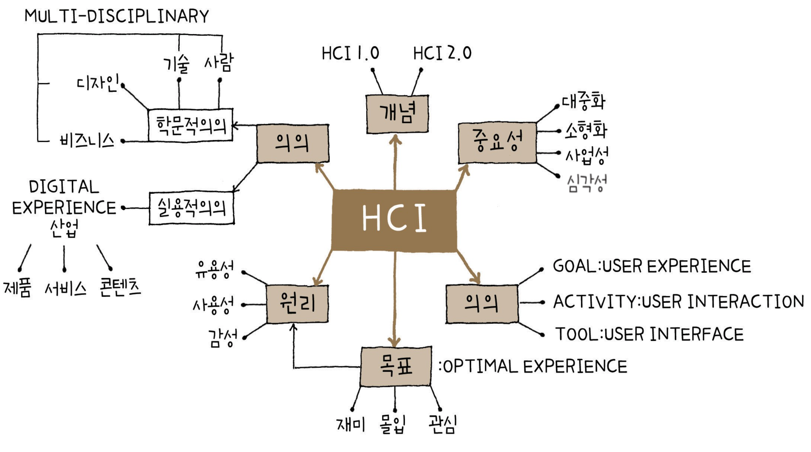
목표를 이루기 위한 원리 세가지 유용성, 사용성, 감성 이 삼박자가 잘 맞아 떨어져야 사용자가 좋아한다.

숙제, 1장을 읽고 1개의 paragraph로 정리해 오기 

## 3월 9일 
## Design Thinking
문제가 있을 때 문제를 어떻게 풀 것인가, 솔루션을 찾아내는 과정. 문제를 개념화 하고 시각화하면, 문제를 다 푼 것이나 마찬가지다.

### What is Interaction Design?
* Designing **interactive products** to support the way people **communicate** and **interact** in their everyday and working lives.
* The design of **spcaes** for human **communication** and **interaction**
* **User Experience** (UX) is key to Interaction Design
	* how a system **feels** to users
	* how users **experience** it.

Interaction Design과 HCI와 overlap되는 부분이 굉장히 많다. HCI도 optimal한 user experience를 제공하는 것이 목표이기 때문.

### Design principles
* Generalizable abstractions for thinking about different aspects of design
* The do's and don'ts of interation design
* What to provide and what not to provide at the interface
* Derived from a mix of theory-based knowledge, experience and common-sense

### Today
* The Psychology of Everyday Things (POET)
* The Design of Everyday Things (DOET)
* Fundamental design principles
* Human-Centered Desing of Cognitive Design

Prof.Donal Norman

> I've come to disconcerting conclusion: design research is great when it comes to **improving existing product** catergories but essentially useless when it comes to **new, innovative breakthroughts.**
> ... grand conceptual inventions happen because technology has finally made them possilbe.
> Use ethnographic observational studies to discover hidden, unmet needs -> **technology first, invention second, needs last**
	 
오늘 배울것은 high-level design principles. 존재하던것을 발전시키는게 좋지, 세상에 없던 새로운것을 만드는 법을 배우는게 쓸모 없더라. 기술이 제일 중요하다.

### Psychopathology of everyday things
* Everyday frustlations
	* Blame it on the users?
		* *Need to read the manual?*
		* *They should learn?*  
	* Blame it on poor design?
		* *Does not take into account basic human capabilities*
			* How humans perceive the world
			* How humans learn
			* How humans deal with error  

누가 메뉴얼을 읽어보냐. 디자인 자체를 blame하게 된다. 사람의 능력치를 고려하지 않고 디자인 하기 되었기 때문이다. 광고하기 위해 기능을 더 넣지만, 괜히 시스템을 복잡하게 만들고 사용하기 힘들게 만든다. 결국 메뉴얼을 읽어 보지 않아도, 사람이 이 물건의 동작방법을 알 수 있게끔 디자인 하는게 중요하다. 즉 사람의 능력을 잘 이해하고 있어야 한다. 어떻게 세상을 받아들이는지, 어떻게 배워가는지, 어떻게 에러를 처리하는지.

* How many of you can program or use all aspects of your
	* Smart Phone?
	* DVD player?
	* washer and dryer
	* stereo system
* Conflicting demands
	* Demands for more features
	* Simplicity of uses

광고를 위해 이것 저것 기능을 추가하면, 오히려 시스템을 복잡하게 만들어 사용성을 떨어뜨린다.

### We're or Designising For Ourselves
사용할 사람들을 위해서 디자인 해야 한다.
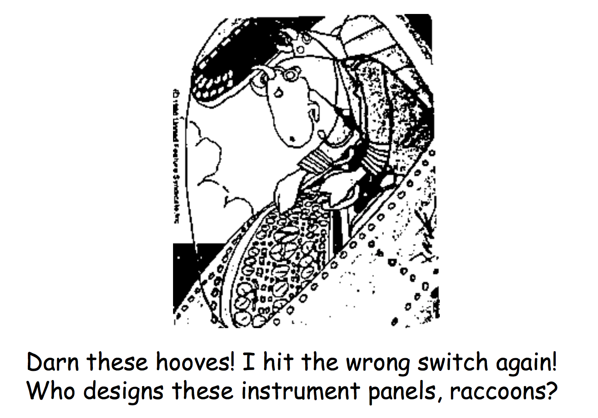

### Fundamental Design Goals
* Provie the right **affordances**

affordance: 처음 봤을때 어떻게 사용해야 할지 알려주는 느낌 e.g., 차의 손잡이를 봤을 때 손가락을 넣고 당기면 된다는 느낌을 받을 수 있다.

### Affordances: "~ is for ~"
* **Perceived** and **actual** properties
* Provide strong clues to the operations of things
	* A chair afford sitting = A chair is for sitting
	* Buttons are for pushing
	* Knobs are for turning
* Simple things can be used without any needs for words, symbols, trial and error

간단한 물건은 말이나 심볼 없이 바로 사용할 수 있어야한다. 

### Different population, different affordances
* Kids
	 * How to deal with small buttons
* Elderly
	* Age Explorer suit 
* Disabled users...
	* Limited vision, movements

target 대상에 맞게 affordance를 주어야 한다.

### Fundamental Design Goals
* Provide theright affordances
* Provide a good **mapping**  
	* Mercedes seat adjustment
	* 좌석의 모양에 맞게 버튼이 배치 되어있다. 버튼에 따라, 좌석의 어느 부분이 움직일지 쉽게 짐작할 수 있다.
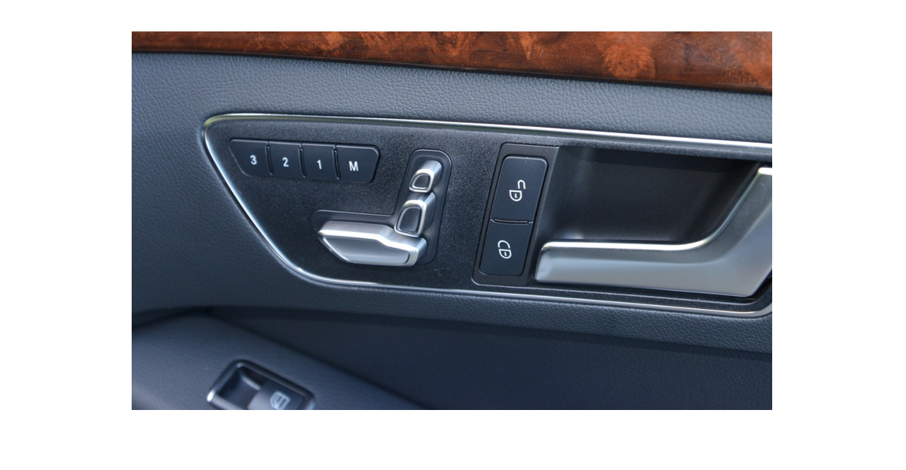  
	
### Natural Mapping
* Relationship between controls and actions should be apparent to users
* Minimize the need for **labels** or **legends**
* Work by "logical constraints"

### Design Principles
* Utilize narratives of space and time
	* Tell a story of position and chronology through visual elements 

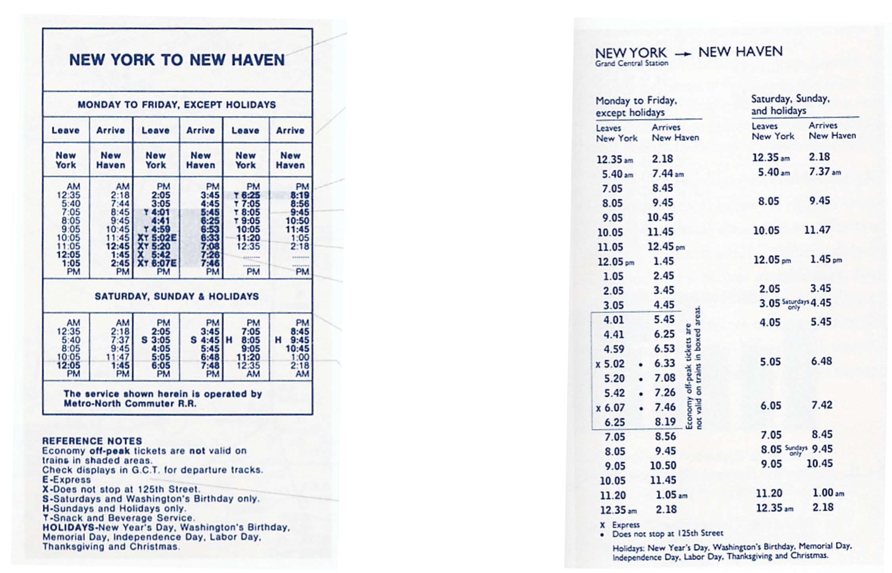  
legend가 너무 많고, 시간순서를 가로로 늘어뜨려 놓아 보기가 불편하다.

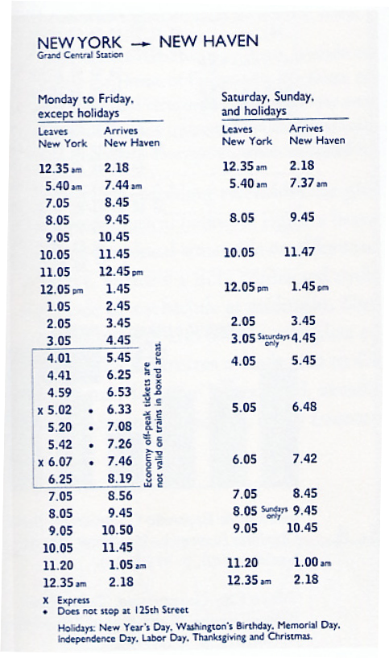  
legend가 훨씬 줄어들었으며, 시간순서를 세로로 늘어뜨려 보기도 편해졌으며, 주말의 경우 평일에 비해 언제 안오는지를 한눈에 알아 볼 수 있게 되었다.

### Natural Mapping: Gas Stove
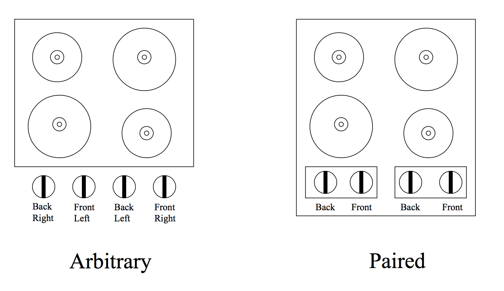
왼쪽의 Gas Stove의 경우 valve와 stove가 arbitrary하게 연결되어 있어서, 사용자에게 불편함을 준다. Mapping이 natural하지 못해 사용자가 익숙해지는데 오랜 시간이 들게 한다. 그 반면 오른쪽의 경우 back과 front pair로 mapping을 시켜놔서 사용자에게 intuition을 줄 수 있으며, 사용하기 쉽게 만들어 준다.

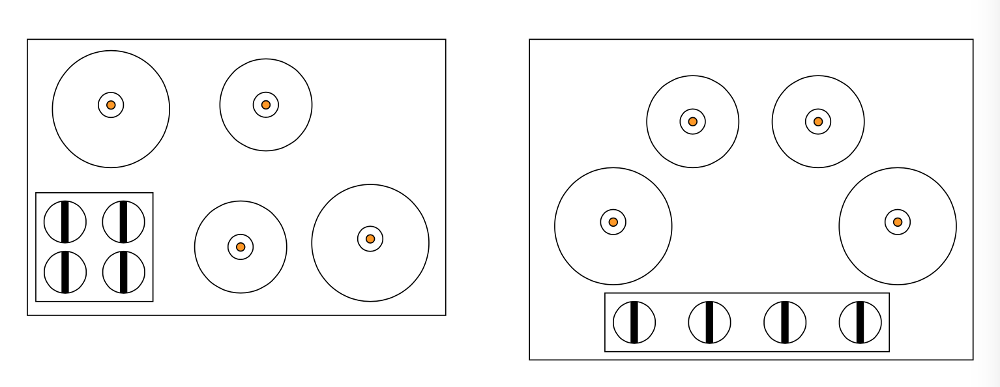

* Full natual mapping between controls and burners

왼쪽의 경우 stove가 배치된 모양대로 valve를 mapping 시켜놨다. 매우 Natural하여 label이 필요 없게 되었다. 별거 아닌 변화도 매우 큰 임팩트를 줄 수 있다. 오른쪽의 경우 아이디어는 쿨하지만 공간이 낭비되기 때문에 실용적이지 못하다. 교수님은 paired에서 valve를 앞뒤로 조금 차이를 둬서 label을 없앨 수 있을 거라 하셨다. 나 같은 경우 stove들의 size가 차이가 있으니 valve도 size차이를 둬서 label을 없앨 수 있을 거라 생각하였다.

### Visible Constraints
* Limit the possible actions by appearnce
* Prevent errors

외형을 이용해 행동의 제한을 둬서 발생할 수 있는 error를 막는 것이다.

### Classification of Constraints
* Physical Constraints
	* Physical limitations constrain possible operations
* Semantic Constraints
	* Depending on our meaning of situation
* Cultural Contraints
	* Allowable actions for social situations
* **Logical Constraints**
	* only one pieceleft, only one possible place to go
	* spatial layout of components
	* **"Natural mapping"** work by this contraints
    
### Fundamental Design Goals
* Provide the right affordances
* Provide a good mapping 
* Provide the right **conceptual model**
	* Fridge control

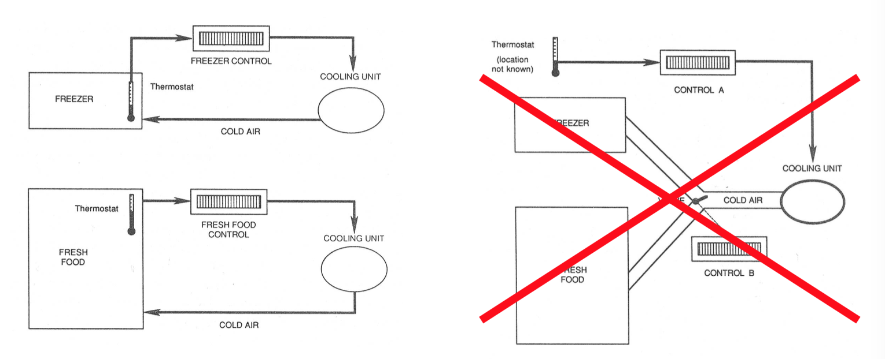
왼쪽이 안좋은 design인 이유는 아마도 A를 조절해도 냉장실의 온도가 바뀌고, B를 조절해도 냉동실의 온도가 바뀌어서 그럴 것이다. 즉 사용자는 A를 조절하면 냉동실만 바뀔 것이라고, B를 조절하면 냉장실만 바뀔 것이라고 예측할텐데 실제는 그렇지 않기 때문이다. 

### Conceptual Model
* Mental model of how things work
* Formed by
	* Affordances
	* Constraints
	* Mappings
	* **Experience**
	* **Training**
	* **Instruction** 

### Three Conceptual Models
* Three aspects of mental models
	* Design model
	* User's model
	* System image

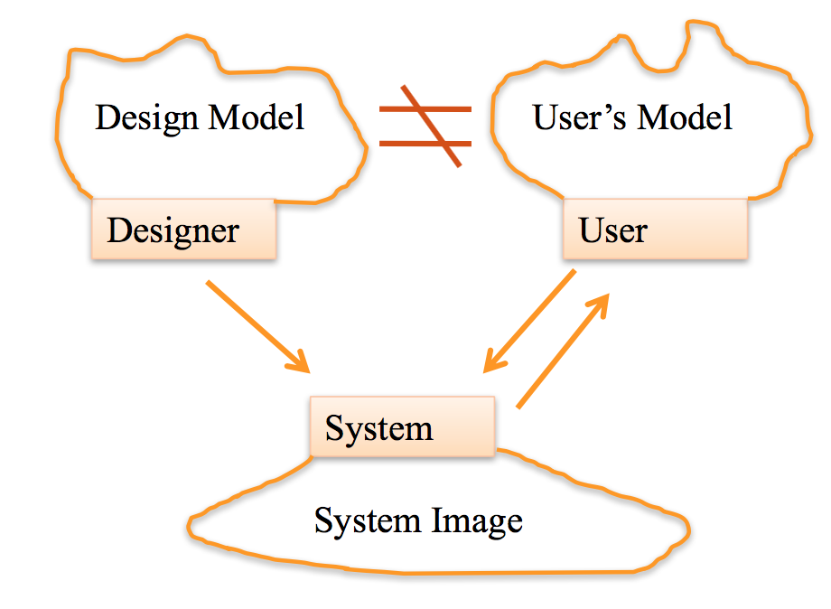 

### Conceptual Model: Scissors
* Affordances
	* All parts are visible -> Holes for fingers to be inserted
* Mapping by Constraints
	* Fingers and holes (different size)
* Transfer Effect
	* Learnt constraints from adults   

좋은 conceptual model은 **implication** (예상되는 결과, 영향) 이 clear해야 한다.

**make things visible**: 꼭 눈으로 봐야만 visible한게 아니라 image가 떠오르게 하는 것,  
손을 자연스럽게 내려놓으면 있음, 기능이 너무 많으면 헷갈린다.

**provide feedback**: (0.1초 안에 줘야 바로바로 feedback이 온다고 생각하게됨) feedback을 잘 줘야causality를 느낄 수 있다.

**recognize causality**: 원인과 결과를 알 수 있게 해주어야함. touch는 discoverability가 있다. 누르면 뭔일이 일어난 줄 몰름

### Cauality
* Causality - interpretation of "feedback"
* People assume that the thing that happens right after an action be caused by that action
* False causality
	* incorrect effect
		* causes "superstitious" behaviors
	* invisible effect
		* command with no apparent result often re-entered repeatedly
		* e.g., mouse click to raise menu on unresponsive system

### Fundamental Design Goals
* Provide the right **affordances**
* Provide a good mapping (by logical **constraints**)

=> Provide the right conceptual model

* Make things **visible**
* Provide **feedback**

=> Recognize causality

* Maintain **consistency**  
	* similar elements for achieving similar tasks

### Other Constraints to Consider
* Cost
	* But it costs more to manufacturer a good input device
* Space
	* But there isn't room to put one controller per function
* Discoverability
	* Given that we've hidden some controls, how do people find them?     

## 3월 14일
## Historical Perspective of HCI

HCI에서 배워야 할 것: **User-Centerd Design**, Data를 어떤 것을 쓸건지 고민을 해야한다. 

### Questions
* Historical perspective of HCI
	* a short history of "computer"
	* major development in HCI fields

### Early example: Astrolabe (Middle Age)
불가능한 것을 가능하게 만듬, 태양과 별의 위치, 계절, 고도를 알 수 있게 해줌. 이런 것들도 HCI의 기반이다. 복잡한 computation을 편리한 interface를 사용해서 쉽게 할 수 있도록 했다.

### "As We May Think" Vannervar Bush (1945), Memex (1945)
Vannervar Bush published "As We May Think". information technology의 발전 방향을 제시함. Memex: memory extension 이게 구현된게 Web이라 생각하면 됨.

* In Atlantic Monthly
* the theoretical proto-hypertext computer system
* read a large self-contained research library, and add or follow associative trails of links and notes (associative indexing)

Precursor to

* Hypertext
* The Web
* Digital Libraries
* Recorded human memory

But no serach, search는 Google발전 시켰다. 

### Sketchpad (1963)
* Ivan E Sutherland's PhD thesis
* "taling to computer graphically"
* "don't know what the problem is and how to solve it"
* "making computer almost like a human assistance"
* let human solve the problem as they are formulating  it

sketchpad: sketch를 가능하게 만듬, 어떻게 하면 컴퓨터와 소통할것인가에 대해 초점을 맞춰서 디자인 하였다. 컴퓨터를 나의 조수로써 행동하게 하자. Solution을 바로 제시하는게 아니라, 문제를 formulation하도록 도와줌.

### Sketchpad: "Direct Manipulation"
* Direct manipulation features:
	* Visibility of objects
	* Incremental action and rapid feedack
	* Reversibility e.g., ctrl + z
	* Exploration (방법을 모를 때 이리저릴 시도해 보는 것)
	* Syntatic correctness of all actions
	* Replacing language with action
* Term coined by Ben Shneiderman

**Direct Manipulation** ex) 폴더를 잡고 끈다던지, 커서를 사용해서 그림을 그린다던지. 이 전에는 다 커맨드로 이뤄짐. 직접 할 수 있다는게 매우 혁명, 혁신적인 일이 었다. computer graphics의 시초.

### Sketchpad
* founding father of Computer Graphics
* done with computing power far less than lod palm pilot

> "Having a computer helping human sloving a problem by letting human solve the problem as they are formulating it."

* 2 handed interactions
* Immdeiate feedback
* Magnetic snap
* Constraints
* But no user study of Sketchpad

이 당시에는 HCI 학문이 정립되기 전이어서 Sketchpad를 user들이 잘 사용할 수 있는지에 대한 연구 같은 것은 진행되지 않았다.

### Invention of the Mouse Doug Engelbart (1963)
One button mouse를 최초로 만들었다. 멀리 떨어져 있는 사람과 동시에 문서를 편집하는 데모를 실제로 진행하였다. 엄청난 것임

### HCI's First User Study
여러 interaction 기구들을 user들에게 사용하게 하여 어느것이 가장 정확하고 빠른지 실험하였다.

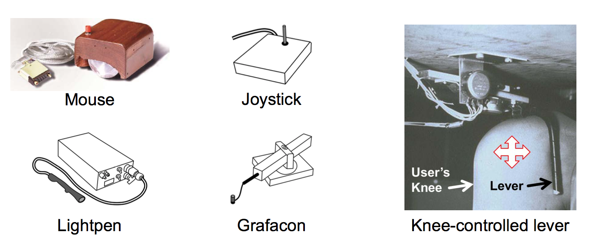

### Experiment Design
* Participants: 13
* Independent variable
	* “Input method” with six levels: mouse, light pen, Grafacon, joystick (position-control), joystick (rate-control), knee-controlled lever
* Dependent variables
	* Task completion time, error rate
	* (Note: task completion time = access time + motion time)
* Within-subject, counterbalanced
* Task:
	* Press spacebar, acquire device, position cursor on target, select target

	 
dependent = 측정하는 값  
independent = 바꾸는 값  
within-subject: 모든 사람이 모든 기구를 다썼다.  
counterbalanced: 순서는 달랐다.

### Result (1)
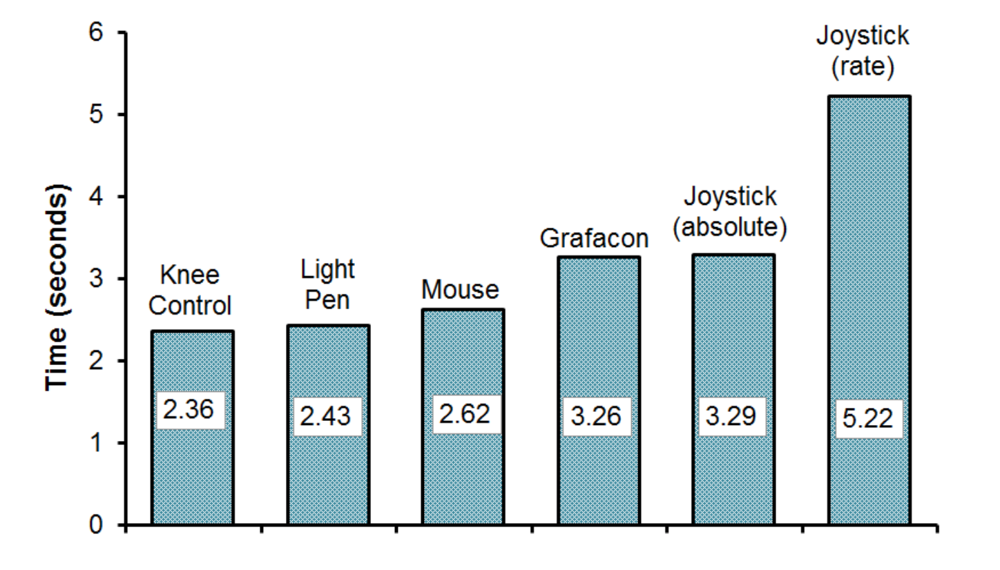
분산도 그려야 한다.

### Result (2)

분산도 그려야 한다.

### NLS (Douglas Engelbart, 1968)
* Mouse
* A cording keyboard
* Foldable outline system
* Hypertext
* Online help...
* Direct text manipulation
* Shared-screen collaboration
	* involbin two persons at different sites communicating over a network with audio and video interface.

### Alto (mid-70's) & Star (1981)
현재의 PC의 기초가 되었으며, GUI를 가진 OS를 가지고 있었다. 

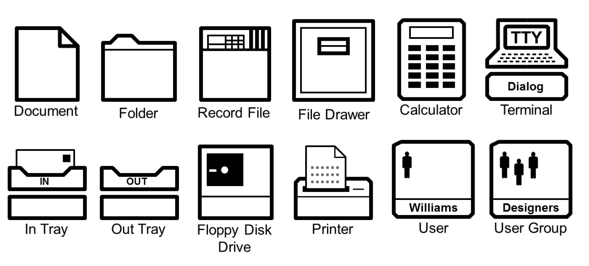

* Number of mouse buttons
* Mouse vs. cursor keys (text 편집시에 cursor key와 mouse를 분리 하였다
* Progressive exposure (처음 부터 모든 feature를 다 보여주는 것이 아니라 차근차근)
* Direct manipulation
* WYSIWYG (what you see is what you get: 니가 보는 데로 프린트 될 것 이다)

### Apple IIe (1977 ~ 1993)
* longest-lived computer in Apple's history
* reset key (잘 죽어서 ㅋㅋ)
* auto-repeat function (a키 꾹 누르면 aaaaaa)
* full ASCII character set
* input/display lower case letters (이전 까지는 모두  upper case만 나옴)

Apple이 HCI 혁신 연구를 잘 가져와서 상업화 했다.

### Birth of HCI - 1983
* Notable events:
	1. First ACM SIGCHI conference (1983)
	2. Publication of The Psychology of Human-Computer Interaction by Card, Moran, and Newell (1983)
	3. Apple Macintosh announced via brochures (December, 1983) and launched (January, 1984)

넓고 얕은게 target을 선택 할때 좋다.

## 3월 21일
## Information Visualization

information visualization은 그림을 그리는데 정답이 없는, 추상적인 data를 대상으로 한다. scientific visulazation은 답이 정해져 있다. 빨리 실물과 같게 할 것 이냐. e.g., 뉴욕 central park를 뛴 사람들의 gps data의 visualization.

https://fathom.info/aging/  이 정도는 구현해야함

spread sheet을 보고 바로 정보를 얻어내기가 어렵다. scatter plot 만으로도 data가 어떤 특성을 가지고 있는지 알아낼 수 있다.

cognition: 눈으로 본다음에 어떤 판단을 내리는 것

wokring memory를 확장 시켜주는 aritificial memory, 복잡한 data를 잘 visualization하면 working memory를 extend할 수 있으며, 찾을 수 없었던 정보를 얻어낼 수도 있다. cognition을 건너 뛸 수 있게 해준다.

visual encoding Idiom (-> Principle)

real-time이 매우 중요함 (100ms 까지는 괜찮음 15fps) data양이 너무 많아서 100ms를 만족 못 시키는 경우가 생기고 있다.

## 3월 23일

### Perception for InfoVis
Effective하냐? 차 옆에 나라이름 쓰는게 더 effective함 Expressiveness하냐? 막대가 무언가 의미 있는 것 처럼 보임

relative perception은 잘하지만 absolute perception은 잘 못한다.

1:4를 보여줄 때 무엇을 쓸까? 막대기가 제일 좋다.

전체 기준을 줘버리니까 어느 것이 긴지 한번에 알아봄 왜냐? 작은것을 보고 비교하게 되니까. 큰 것 두개를 비교할 때는 작은 차이가 잘 보이지 않지만, 작은 것 두개를 비교 할 때는 작은 차이가 잘 보인다.

user가 무엇을 원하느냐에 따라 best representation이 달라진다.

### Mapping
data를 가공해서 encoding 해야함

attention하기 전에 cognition이 된다.

사람이 motion을 잘 catch 한다.

스까 쓰지 말아라

task에 따라 visual representation의 ranking이 달라짐
