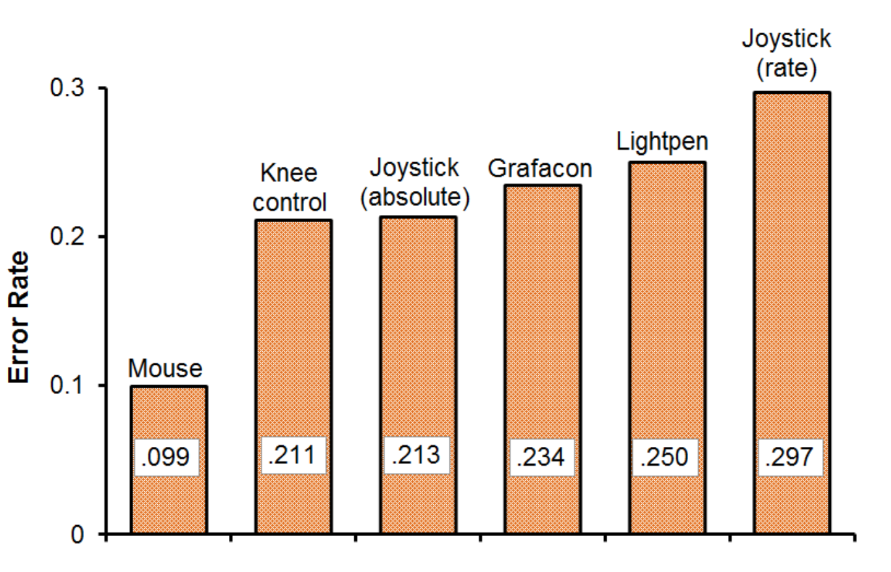
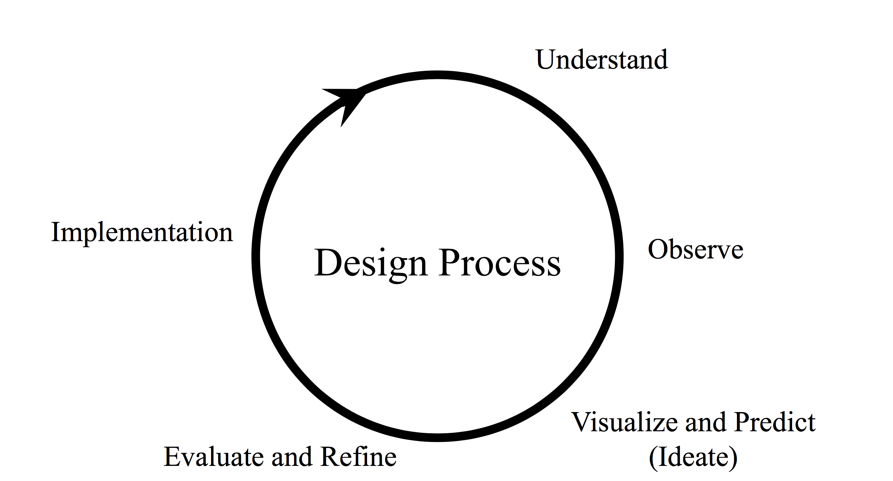
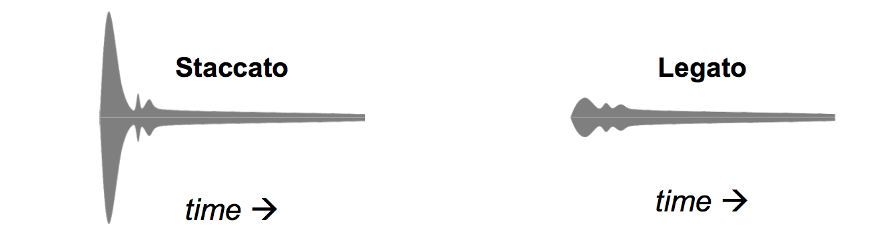

# Human Computer Interaction
Human-Computer Interaction is a field of study on designing, implementing, and evaluating interactive computing systems for human use, and it is also concerned with the major phenomena surrounding them. Recently, HCI has drawn lots of attention from software industry and various research labs for its practical applications and commercial merits. There are many computing systems that are fancy looking and computationally efficient, but often they are not practically efficient even though they are implemented exactly following the software specification. Most of those failures are due to the fact that software designers overlook the golden rule of HCI, that is to know the user.  In this course, we will learn the fundamental components and practical techniques of HCI. We will start with studying designs of everyday objects to motivate the efficient design of interactive computing systems. Then, we will learn HCI theories and techniques on how to involve users in designing and evaluating interactive computing systems. We will apply them in our class projects to solidify our HCI knowledge. In doing so, we can go beyond the conventional perception that HCI is just about a set of techniques for building graphically appealing user interfaces.

Term Project (group of two students): Each student should perform a class project on an interactive (graphical) user interface design. The project theme will be announced in the first week of the class.

Readings: There will be several reading assignments and occasional other exercises.

Hall of Fame/Shame presentation: Each student will have to choose an interface to analyze it from the standpoint of HCI. At the beginning of each class, a student will have to do a short 5-minute presentation on his/her analysis result. You can choose to put it in the Hall of Fame or Shame of user interface.

Homeworks: There will be several homework assignments which require some programming.  There will be several in-class exercises where students can learn design/evaluation strategies used in industries.

## 3월 7일
## HCI: Human-Computer Interaction
HCI를 완벽하게 정의하기는 어렵다. 그렇다면 HCI 수업시간에는 무엇을 배워야 할까?  
Human을 위한 Interactive한 computing system과 그것들을 둘러싼 여러 현상들을 어떻게 **평가**하고 **디자인**, **구현**, **분석**할 것인가에 대해서 배운다.  

### HCI가 중요해지는 배경
상품이 성공해서 잘 팔릴려면, 다양한 사람들의 needs를 잘 엮어서 디자인할 수 있는지에 대한 방법론이 있어야 한다.   
특허 혹은 사업적으로도 User Interface가 매우 중요해졌다. (ex. 삼성 애플 특허 싸움)

### User Experience 
* ISO에서 정의한 UX: A person’s **perceptions** and **responses** that result from the use or anticipated use of a product, system or service.  
* UX란 real world에서 product가 어떻게 행동하며 어떻게 user들에 의해 사용되는지이다.  
* UX의 정의는 사람마다 각자 다르게 내린다. 그렇기에 Engineer들이 보기에 과학이나 공학이 아니라고 볼 수도 있지만, 재밌다. 
* Cannot design a user experience, only design *for* a user experience. 즉 user experience를 간접적으로 design하고 설계할수는 있어도 직접적으로는 불가능하다. (말 그대로 user의 experience이기 때문)

### UX의 특징은?
* Humane But Soft: soft? 인도적이지만 부드럽다? 말랑말랑하다. 확실하게 정의 할수 없다.
* Strategic But Abstract: (회사에서) 전략적으로 UX를 디자인 해야한다. 그러나 구체적이지 않고 추상적이다. 말하긴 쉬운데 시스템으로 만들기는 매우 힘들다.  
* Contextual But Uncertain: 이 제품을 어떤 context에서 사용할지 이해하고 디자인 해야한다, 그러나 context가 너무 다양하기 때문에 uncertain하다. 
 
결국 UX는 적절한 방법론과 이론이 없다면 mirage(신기루) 처럼 될 수 있다. 방법론과 이론을 제시해주는게 HCI학문이다.

> HCI is a field that provides Theories and Methodologies for Optimal UX.

### Optimal User Experience: Goal of HCI
* Key Factors of Optimal User Experience
	* **Usefulness** (유용성)
		* help users achieve their goals (effectively)
	* **Usability** (사용성)
		* use with ease, efficiency and satisfaction
	* **Affection** (감성)
		* **aesthetic** response
		* **semantic** and symbolic meanings
		* goal achievement and its **emotional** consequence
 
### Usefulness
유용성이 없다면 밑으로 갈 수가 없다. 일단 유용해야한다. 사용자들이 그들의 목표를 얻을 수 있도록 도와줘야한다.

### Usability
> The extent to which a product can be used by ***specified*** **users** to achieve ***specified*** **goals** with effectiveness, efficiency, and satisfaction in a ***specified*** **context of use**
   
디자인 하기 전에 타겟 유저를 정해야 한다. 타겟 유저를 잘못 정한다면 망하는 지름길이다. user, goal and context의 삼박자가 잘 갖춰줘야 한다.

### Usability Goals
* (Have good utility)
* Effective to use
* Efficient to use
* Easy to learn
* Easy to remember how to use
* Safe to use

How to measure it? => Usability Criteria

* time to learn (**learnability**)
* speed of performance (**efficiency**)
* rate of human error (**effectiveness**)
* human retention over time (**memorability**)
* subjective satisfaction

### Beyond Usability - Affection
* design to persuade people 
	* 쓰면 내가 뭔가 된 것 같고, 멋있어 보일것 같고 그런 것들
	* ex) 애플제품 
* make shopping easy vs. persuade people to buy
* persuade in subtle and pleasant ways
* Emotional Design (Donald Norman)
	*  using pre-existing perception to persuade users
	*  design of objects are perceived on three levels:
		* visceral(내재적으로, 감정적으로), behavioral, refelective levels  

목표를 이루기 위한 원리 세가지 유용성, 사용성, 감성 이 삼박자가 잘 맞아 떨어져야 사용자가 좋아한다.

숙제, 1장을 읽고 1개의 paragraph로 정리해 오기 

## 3월 9일 
## Design Thinking
문제가 있을 때 문제를 어떻게 풀 것인가, 솔루션을 찾아내는 과정. 문제를 개념화 하고 시각화하면, 문제를 다 푼 것이나 마찬가지다.

### What is Interaction Design?
* Designing **interactive products** to support the way people **communicate** and **interact** in their everyday and working lives.
* The design of **spcaes** for human **communication** and **interaction**
* **User Experience** (UX) is key to Interaction Design
	* how a system **feels** to users
	* how users **experience** it.

Interaction Design과 HCI와 overlap되는 부분이 굉장히 많다. HCI도 optimal한 user experience를 제공하는 것이 목표이기 때문.

### Design principles
* Generalizable abstractions for thinking about different aspects of design
* The do's and don'ts of interation design
* What to provide and what not to provide at the interface
* Derived from a mix of theory-based knowledge, experience and common-sense

### Today
* The Psychology of Everyday Things (POET)
* The Design of Everyday Things (DOET)
* Fundamental design principles
* Human-Centered Desing of Cognitive Design

Prof.Donal Norman

> I've come to disconcerting conclusion: design research is great when it comes to **improving existing product** catergories but essentially useless when it comes to **new, innovative breakthroughts.**
> ... grand conceptual inventions happen because technology has finally made them possilbe.
> Use ethnographic observational studies to discover hidden, unmet needs -> **technology first, invention second, needs last**
	 
오늘 배울것은 high-level design principles. 존재하던것을 발전시키는게 좋지, 세상에 없던 새로운것을 만드는 법을 배우는게 쓸모 없더라. 기술이 제일 중요하다.

### Psychopathology of everyday things
* Everyday frustlations
	* Blame it on the users?
		* *Need to read the manual?*
		* *They should learn?*  
	* Blame it on poor design?
		* *Does not take into account basic human capabilities*
			* How humans perceive the world
			* How humans learn
			* How humans deal with error  

누가 메뉴얼을 읽어보냐. 디자인 자체를 blame하게 된다. 사람의 능력치를 고려하지 않고 디자인 하기 되었기 때문이다. 광고하기 위해 기능을 더 넣지만, 괜히 시스템을 복잡하게 만들고 사용하기 힘들게 만든다. 결국 메뉴얼을 읽어 보지 않아도, 사람이 이 물건의 동작방법을 알 수 있게끔 디자인 하는게 중요하다. 즉 사람의 능력을 잘 이해하고 있어야 한다. 어떻게 세상을 받아들이는지, 어떻게 배워가는지, 어떻게 에러를 처리하는지.

* How many of you can program or use all aspects of your
	* Smart Phone?
	* DVD player?
	* washer and dryer
	* stereo system
* Conflicting demands
	* Demands for more features
	* Simplicity of uses

광고를 위해 이것 저것 기능을 추가하면, 오히려 시스템을 복잡하게 만들어 사용성을 떨어뜨린다.

### We're not Designising For Ourselves
사용할 사람들을 위해서 디자인 해야 한다.

### Fundamental Design Goals
* Provie the right **affordances**

affordance: 처음 봤을때 어떻게 사용해야 할지 알려주는 느낌 e.g., 차의 손잡이를 봤을 때 손가락을 넣고 당기면 된다는 느낌을 받을 수 있다.

### Affordances: "~ is for ~"
* **Perceived** and **actual** properties
* Provide strong clues to the operations of things
	* A chair afford sitting = A chair is for sitting
	* Buttons are for pushing
	* Knobs are for turning
* Simple things can be used without any needs for words, symbols, trial and error

간단한 물건은 말이나 심볼 없이 바로 사용할 수 있어야한다. 

### Different population, different affordances
* Kids
	 * How to deal with small buttons
* Elderly
	* Age Explorer suit 
* Disabled users...
	* Limited vision, movements

target 대상에 맞게 affordance를 주어야 한다.

### Fundamental Design Goals
* Provide the right affordances
* Provide a good **mapping**  
	* Mercedes seat adjustment
	* 좌석의 모양에 맞게 버튼이 배치 되어있다. 버튼에 따라, 좌석의 어느 부분이 움직일지 쉽게 짐작할 수 있다.
  
	
### Natural Mapping
* Relationship between controls and actions should be apparent to users
* Minimize the need for **labels** or **legends**
* Work by "logical constraints"

### Design Principles
* Utilize narratives of space and time
	* Tell a story of position and chronology through visual elements 

  
왼쪽의 경우 legend가 너무 많고, 시간순서를 가로로 늘어뜨려 놓아 보기가 불편하다.  
오른쪽의 경우 legend가 훨씬 줄어들었으며, 시간순서를 세로로 늘어뜨려 보기도 편해졌으며, 주말의 경우 평일에 비해 언제 안오는지를 한눈에 알아 볼 수 있게 되었다.

### Natural Mapping: Gas Stove

왼쪽의 Gas Stove의 경우 valve와 stove가 arbitrary하게 연결되어 있어서, 사용자에게 불편함을 준다. Mapping이 natural하지 못해 사용자가 익숙해지는데 오랜 시간이 들게 한다. 그 반면 오른쪽의 경우 back과 front pair로 mapping을 시켜놔서 사용자에게 intuition을 줄 수 있으며, 사용하기 쉽게 만들어 준다.

* Full natual mapping between controls and burners

왼쪽의 경우 stove가 배치된 모양대로 valve를 mapping 시켜놨다. 매우 Natural하여 label이 필요 없게 되었다. 별거 아닌 변화도 매우 큰 임팩트를 줄 수 있다. 오른쪽의 경우 아이디어는 쿨하지만 공간이 낭비되기 때문에 실용적이지 못하다. 교수님은 paired에서 valve를 앞뒤로 조금 차이를 둬서 label을 없앨 수 있을 거라 하셨다. 나 같은 경우 stove들의 size가 차이가 있으니 valve도 size차이를 둬서 label을 없앨 수 있을 거라 생각하였다.

### Visible Constraints
* Limit the possible actions by appearnce
* Prevent errors

외형을 이용해 행동의 제한을 둬서 발생할 수 있는 error를 막는 것이다.

### Classification of Constraints
* Physical Constraints
	* Physical limitations constrain possible operations
* Semantic Constraints
	* Depending on our meaning of situation
* Cultural Contraints
	* Allowable actions for social situations
* **Logical Constraints**
	* only one piece left, only one possible place to go
	* spatial layout of components
	* **"Natural mapping"** work by this contraints
    
### Fundamental Design Goals
* Provide the right affordances
* Provide a good mapping 
* Provide the right **conceptual model**
	* Fridge control

왼쪽이 안좋은 design인 이유는 아마도 A를 조절해도 냉장실의 온도가 바뀌고, B를 조절해도 냉동실의 온도가 바뀌어서 그럴 것이다. 즉 사용자는 A를 조절하면 냉동실만 바뀔 것이라고, B를 조절하면 냉장실만 바뀔 것이라고 예측할텐데 실제는 그렇지 않기 때문이다. 

### Conceptual Model
* Mental model of how things work
* Formed by
	* Affordances
	* Constraints
	* Mappings
	* **Experience**
	* **Training**
	* **Instruction** 

### Three Conceptual Models
* Three aspects of mental models
	* Design model (the conceptualization the designer had in mind)
	* User's model (what the user develops to explain the operation of the system)
	* System image (ths systems's appearance, operation, way it responds, manuals/insturctions included with it)

Ideally, the design model and user model are the same. The designer must ensure that the system image is consistent with and operates according to the proper conceptual model.

 

### Conceptual Model: Scissors
* Affordances
	* All parts are visible -> Holes for fingers to be inserted
* Mapping by Constraints
	* Fingers and holes (different size)
* Transfer Effect
	* Learnt constraints from adults   

좋은 conceptual model은 **implication** (예상되는 결과, 영향) 이 clear해야 한다.

**make things visible**: 꼭 눈으로 봐야만 visible한게 아니라 image가 떠오르게 하는 것,  
손을 자연스럽게 내려놓으면 있음, 기능이 너무 많으면 헷갈린다.

**provide feedback**: (0.1초 안에 줘야 바로바로 feedback이 온다고 생각하게됨) feedback을 잘 줘야 causality 를 느낄 수 있다.

**recognize causality**: 원인과 결과를 알 수 있게 해주어야함. touch는 discoverability가 있다. 누르면 뭔일이 일어난 줄 몰름

### Causality
* Causality - interpretation of "feedback"
* People assume that the thing that happens right after an action be caused by that action
* False causality
	* incorrect effect
		* causes "superstitious" behaviors
	* invisible effect
		* command with no apparent result often re-entered repeatedly
		* e.g., mouse click to raise menu on unresponsive system

### Fundamental Design Goals
* Provide the right **affordances**
* Provide a good mapping (by logical **constraints**)

=> Provide the right conceptual model

* Make things **visible**
* Provide **feedback**

=> Recognize causality

* Maintain **consistency**  
	* similar elements for achieving similar tasks

### Other Constraints to Consider
* Cost
	* But it costs more to manufacturer a good input device
* Space
	* But there isn't room to put one controller per function
* Discoverability
	* Given that we've hidden some controls, how do people find them?     

## 3월 14일
## Historical Perspective of HCI

HCI에서 배워야 할 것: **User-Centerd Design**, Data를 어떤 것을 쓸건지 고민을 해야한다. 

### Questions
* Historical perspective of HCI
	* a short history of "computer"
	* major development in HCI fields

### Early example: Astrolabe (Middle Age)
불가능한 것을 가능하게 만듬, 태양과 별의 위치, 계절, 고도를 알 수 있게 해줌. 이런 것들도 HCI의 기반이다. 복잡한 computation을 편리한 interface를 사용해서 쉽게 할 수 있도록 했다.

### "As We May Think" Vannervar Bush (1945), Memex (1945)
Vannervar Bush published "As We May Think". information technology의 발전 방향을 제시함. Memex: memory extension 이게 구현된게 Web이라 생각하면 됨.

* In Atlantic Monthly
* the theoretical proto-hypertext computer system
* read a large self-contained research library, and add or follow associative trails of links and notes (associative indexing)

Precursor to

* Hypertext
* The Web
* Digital Libraries
* Recorded human memory

But no serach, search는 Google발전 시켰다. 

### Sketchpad (1963)
* Ivan E Sutherland's PhD thesis
* "talking to computer graphically"
* "don't know what the problem is and how to solve it"
* "making computer almost like a human assistance"
* let human solve the problem as they are formulating  it

sketchpad: sketch를 가능하게 만듬, 어떻게 하면 컴퓨터와 소통할것인가에 대해 초점을 맞춰서 디자인 하였다. 컴퓨터를 나의 조수로써 행동하게 하자. Solution을 바로 제시하는게 아니라, 문제를 formulation하도록 도와줌.

### Sketchpad: "Direct Manipulation"
* Direct manipulation features:
	* Visibility of objects
	* Incremental action and rapid feedack
	* Reversibility e.g., ctrl + z
	* Exploration (방법을 모를 때 이리저릴 시도해 보는 것)
	* Syntatic correctness of all actions
	* Replacing language with action
* Term coined by Ben Shneiderman

**Direct Manipulation** ex) 폴더를 잡고 끈다던지, 커서를 사용해서 그림을 그린다던지. 이 전에는 다 커맨드로 이뤄짐. 직접 할 수 있다는게 매우 혁명, 혁신적인 일이 었다. computer graphics의 시초.

### Sketchpad
* founding father of Computer Graphics
* done with computing power far less than lod palm pilot

> "Having a computer helping human sloving a problem by letting human solve the problem as they are formulating it."

* 2 handed interactions
* Immdeiate feedback
* Magnetic snap
* Constraints
* But no user study of Sketchpad

이 당시에는 HCI 학문이 정립되기 전이어서 Sketchpad를 user들이 잘 사용할 수 있는지에 대한 연구 같은 것은 진행되지 않았다.

### Invention of the Mouse Doug Engelbart (1963)
One button mouse를 최초로 만들었다. 멀리 떨어져 있는 사람과 동시에 문서를 편집하는 데모를 실제로 진행하였다. 엄청난 것임

### HCI's First User Study
여러 interaction 기구들을 user들에게 사용하게 하여 어느것이 가장 정확하고 빠른지 실험하였다.

### Experiment Design
* Participants: 13
* Independent variable
	* “Input method” with six levels: mouse, light pen, Grafacon, joystick (position-control), joystick (rate-control), knee-controlled lever
* Dependent variables
	* Task completion time, error rate
	* (Note: task completion time = access time + motion time)
* Within-subject, counterbalanced
* Task:
	* Press spacebar, acquire device, position cursor on target, select target

	 
dependent = 측정하는 값  
independent = 바꾸는 값  
within-subject: 모든 사람이 모든 기구를 다썼다.  
counterbalanced: 순서는 달랐다.

### Result (1)

분산도 그려야 한다.

### Result (2)

분산도 그려야 한다.

### NLS (Douglas Engelbart, 1968)
* Mouse
* A chording keyboard
* Foldable outline system
* Hypertext
* Online help...
* Direct text manipulation
* Shared-screen collaboration
	* involbin two persons at different sites communicating over a network with audio and video interface.

### Alto (mid-70's) & Star (1981)
현재의 PC의 기초가 되었으며, GUI를 가진 OS를 가지고 있었다. 

* Number of mouse buttons
* Mouse vs. cursor keys (text 편집시에 cursor key와 mouse를 분리 하였다
* Progressive exposure (처음 부터 모든 feature를 다 보여주는 것이 아니라 차근차근)
* Direct manipulation
* WYSIWYG (what you see is what you get: 니가 보는 데로 프린트 될 것 이다)

### Apple IIe (1977 ~ 1993)
* longest-lived computer in Apple's history
* reset key (잘 죽어서 ㅋㅋ)
* auto-repeat function (a키 꾹 누르면 aaaaaa)
* full ASCII character set
* input/display lower case letters (이전 까지는 모두  upper case만 나옴)

Apple이 HCI 혁신 연구를 잘 가져와서 상업화 했다.

### Birth of HCI - 1983
* Notable events:
	1. First ACM SIGCHI conference (1983)
	2. Publication of The Psychology of Human-Computer Interaction by Card, Moran, and Newell (1983)
	3. Apple Macintosh announced via brochures (December, 1983) and launched (January, 1984)

넓고 얕은게 target을 선택 할때 좋다.

## 3월 21일
## Information Visualization
### What is it?
* Scientific Visualization vs. Information Visualization
* Data Visualization - its power
* Data Visualization - definition

### Visualization
Scientific Visualization 은 빠르고 실물과 동일하게 visualization 하는 것을 목표로 하는 반면 Information Visualization 은 추상적인 data를 사용자에게 정보를 잘 전달하게끔 visulization 하는 것을 목표로 한다. 그렇기에 information visualization 은 정답이 존재 하지 않는다.

[visualization of age](https://fathom.info/aging)

Data가 spread sheet으로 존재하는 경우가 많다. 그러나 spread sheet을 보고 바로 정보를 얻어내기가 어려운데, 그 data를 scatter plot 하는 것 만으로도 data가 어떤 특성을 가지고 있는지 알아낼 수 있다. 또한 통계학적 수치만 보고서 판단하는 것도 오류를 범할 수가 있다. 이런 경우에도 visualization을 통해서 data의 분포나 경향같은 것을 좀더 정확히 알아낼 수 있다.

### Definitions
* The use of computer-supported, interactive, visual representations of ***abstract*** data to amplify **cognition**  
-- Stuart Card, Jock Mackinlay, Ben Shneiderman, 1999
* Finding the ***artificial memory*** that best supports our natural means of perception  
-- Bertin, 1983
* Provides tools that present data in a way to help people understand and gain insight from it.

**cognition**: 눈으로 본다음에 어떤 판단을 내리는 것

wokring memory를 확장 시켜주는 **aritificial memory**, 복잡한 data를 잘 visualization하면 working memory를 extend할 수 있으며 (간단한 예로 2자리수 곱셈을 암산으로 하는 것은 시간도 오래 걸리고 틀릴 확률도 높지만, 연필과 종이를 사용해서 할 경우 훨씬 짧은 시간에 더 정확한 결과를 얻을 수 있다) 찾을 수 없었던 정보를 얻어낼 수도 있다. 

### Why use an external representation?
> Computer-based visualization systems provide **visual representation** of datasets designed to help people carry out tasks more effectively. 

* external representation: replace **cognition** with **perception**

external representation을 통해서 바로 정보를 인식 함으로써 cognition을 건너 뛸 수 있게 해준다.

### Resource limitations
> Vis designer must take into account three very different kinds of resource limitations: those of computers, of humans, and of displays.

* computational limits
	* processing time
	* system memory

* human limits
	* human attention and memory

* display limits
	* pixels are precious resource, the most constrained resource
	* **information density:** ratio of space used to encode info vs unused white space
		* tradeoff between clutter and wasting space, find sweet spot between dense and sparse    

visual encoding Idiom (-> Principle)

### ***InfoVis*** Reference Model

RawData 에서 Data Table 을 만드는 것도 상당히 고역이다. 이런 것만 전문적으로 해주는 프로그램을 만드는 회사도 존재

### Model for Design and Validation Vis System
* Four nested levels of vis design
* Threats to validating each level
	* Why validate? "Design space is large, and most designs are ineffective"

### ***InfoVis*** is Interdisciplinary
* Graphics: drawing in real time (< 100ms)
* Cognitive psychology: appropriate representation
* **HCI:** using users and tasks to guide design and evaluation  

real-time이 매우 중요하다. 100ms(15fps) 안에 반응이 나와야 user 가 인과관계를 파악할 수 있다. 그러나 요즘에는 data양이 너무 많아서 100ms를 만족 못 시키는 경우가 생기고 있다.

## 3월 23일

### Perception for InfoVis
* Visual Perception
* Visual Encodings of Quantitative Data
* Data Types and Tasks for InfoVis

### Any better encodings?

Effective하냐? 차 옆에 나라이름 쓰는게 더 effective함 
Expressiveness하냐? 막대가 무언가 의미 있는 것 처럼 보임

사람은 relative perception은 잘하지만 absolute perception은 잘 못한다.

1:4를 보여줄 때 무엇을 쓸까? 1D-막대기가 제일 좋다. 2D 나 3D 는 바로바로 알기가 매우 어렵다.

### Stevens Power Law
* *p*: perceived magnitude
* *a*: actual magnitude
* *p=ka^α*
* *p1/p2 = (a1/a2)^α*
* length judgment: *α≈1*
* area judgment: *α<1*
* volume judgment *α≪1*

전체 기준을 줘버리니까 어느 것이 긴지 한번에 알아봄 왜냐? 작은것을 보고 비교하게 되니까. 큰 것 두개를 비교할 때는 작은 차이가 잘 보이지 않지만, 작은 것 두개를 비교 할 때는 작은 차이가 잘 보인다.

user가 무엇을 원하느냐에 따라 best representation이 달라진다.

### Mapping
* input
	* data semantics
	* use domain knowledge

* output 
	* visual encoding
		* visual, graphical perceptual, retinal
		* channels, attributes, dimensions, variables
	* use human perception   
	
* processing
	* algorithms
	* handle computational constraints

data를 가공해서 encoding 해야함

### Preattentive Processing
* Cognitive operations done preattentively, wihtout the need for focused attention 
	* less than 200-250 ms
		* eye movements take 200 ms
		* minimum time to initiate eye movement
		* involves only information available in a single glance

* Popout effects
* Segmentation effects

예를 들어서 같은 색의 글씨 중에서 한 글자만 다른 색이라면 그 글자를 attention 하기 전에 cognition이 될 것 이다. 또한 사람은 motion을 잘 catch 하므로 한 글자만 움직이고 있어도 cognition 을 attention 전에 할 것 이다.

### What Kinds of Tasks?
* Target detection
	* Is something there?
* Boundary detection
	* Can the elements be grouped?
* Region tracking
	* Can a distinctive moving group be traced?
* Counting 
	* How many elements of a certain type are present?

### Laws of preattentive disply
* Must stand out on some simple dimension
	* color
	* simple shape = orientation, size
	* motion
	* depth
* Lessons for highlighting - one of each, 스까 쓰지 말아라

task에 따라 visual representation의 ranking이 달라짐

## 3월 28일
### Design Guidelines/Principles
* Visual presentation of query components
* Visual presentation of results
* Rapid, incremental and reversible actions
* Immedicate and continuous feedback
* Selection by pointing (not typing)
* Reduce errors
* Encourages exploration
* **Visual Information Seeking Mantra**
	* Overview first, zoom and filter, details on demand 

### Tufte's Design Principles

* Tell the truth (Expressiveness)
	* **Graphical integrity**
	*  모든 진실을 다 이야기 해라.
* Do it effecively with clarity, precision (Expressiveness)
	* **Design principles/aesthetics**
* "**simple design, intense content**"

### Graphicl Integrity
* Your graphic should tell the truth about your data
* Consider visual perception
* User-centered vs. designer-centered

중간 pick 를 user 입장에서는 찾기가 어렵다. 세로축으로 보는게 아니라 가로축으로 보려고 하기 때문, 시간별 trend 를 얻고 싶은 user 입장에서 나쁜 visualization 이다. 그러나 그 양만을 알고 싶은 user 에게는 좋은 visualization 일 수 있다.

### Measuring Misrepresentation
* Visual attribute value should be directly proportional to data attribute value
* Height/width vs. area vs. volume
* Lie factor = Size of effect shown in graphic / Size of effect in data
* Lie factor 가 1에 가까워야 effective 하게 표현한 것이다.

### Design Principles
* Maximize data-ink ratio

Data ink ratio = Data ink / Total ink used in graphic  
= proportion of graphic's ink devoted to the non-redudant display of data-information

* Avoid chartjunk
	* Extraneous visual elements that detract from information
	* all visual elements in charts and graphs that are not necessary to comprehend the information represented on the graph, or that distract the viewer from this information

그러나 메세지 전달 측면에서는 저런 장식이 도움이 될 수 있다. 하지만 그래프의 y 축의 시작점을 0 으로 놓지 않는다 던가 해서 user 를 속이는 것은 chartjunk 이다.

* Use **small multiples**
	* Repeat visually similar graphical elements nearby rather than spreading far apart
	* The same graphical design structure is repeated 
	* Learn once and compare -> invite comparisons
	* Reveal, all at once, a scope of alternatives, a range of options -> overview 

* Utilize narratives of space and time
	* Tell a story of position and chronology through visual elements 

## 4월 4일
## Design Process: brainstorm
### Affordance
* "A property in which the **physical characteristics** of an object or environment influence its **function**."
	* **Round** wheels are better suited than square wheels for **rolling**.
	* (Desktop) Metaphor
		* Three dimensional buttons on a computer screen.
	* Encourage intended function
	* Discourage improper use

* Make it inconceivable that the design could function or be used otherwise 

### Mapping 
* "A relationship between controls and their movements or effects"
	* Control-effect relationship
	* Control-display relationship
	* Stimulus-response compatibility
	* Good mapping for greate ease of use
	* Effect corresponds to expectation?
	* Avoid one control-multiple effect relationship
		*  Visually distinct modes to **indicate** the current function
	* Consider social/cultural conventions
		* Down to turn it on in UK  

### Mental Model
* "Representations of systems and environments derived from experience"
* System model: mental models of **how systems work**
* Interaction model: mental models of **how people interact with systems**
	* Personal use of the system
	* Lab testing (e.g., Focus groups and Usability testing)
	* Direct observation
		* What about a design that is not yet available?
	* Create an interaction experience that draws from common mental model 
	* Have people learn a new model (clear and consistent)		  
* Conceptual Model

### The IDEO Design Process

* **Understand the problem area**
	* why do we need a new design and how to come up with one
	* produce a small set of key ideas, general orientation

* **Observe potential users and customers**
	* fictitious character maps
	* know the (potential users)

* **Visualize and predict**
	* brainstorm, sketching, prototyping
	* detailed scenarios or storyboards
	* depict the interactions between users and the new device (design)

* **Evaluate and refine**
	* user testing, feedback
	* iterative, spiral development model

* **Implement** 	 

loop를 돌면서 design하는 것을 design process라 한다. 핵심은 loop다.

문제를 이해해야 한다. 누가 쓸것인지 왜 만들어야 하는지, motivation이 필요함, 어떤 문제점이 있어서 새로운 디자인이 필요한지.

새로운 디자인이 나왔으면, 어떻게 만들 것인지, 핵심적인 문제가 있으면 어떻게 해결할 것인지. 구체적인 개선안이 있어야한다. 문제를 파악한 후 문제를 수정하기 위한 핵심적인 아이디어를 몇개 뽑아 놔야한다. 

우리의 해결 방법이 문제를 해결 할 수 있는지 관찰해야 한다. user를 이해하고 user가 어떤 문제점이 있고, 어떤 상황에 있는지 관찰해야한다. 

brain-storm, sketch, prototype 하구 나서 시나리오와 시퀀스를 잡는다. user와 디바이스간의 인터랙션이 어떻게 일어나는지 스케치 해야 한다. 핵심만 그려아한다.

user test를 하고 feedback을 하고 iterative하게 작업한다.

### System Centered Design
* What can be built easily on this platform?
* What can I create from the available tools?
* What do I as a programmer find interesting to work on?

내가 가지고 있는 tool, 능력, system 중심으로 생각해서 design 하는 것
 
### User Centered Design
* Design is based upon a user's
	* Abilities and real needs
	* Context 
	* Work
	* Tasks
 
Golden rule of interfae design: ***Know The User***

* ... is based on **understanding the domain of work of play** in which people are engaged and in which they interact with computers, and programming computers to facilitate human action. ...
*  Three assumptions
	* The result of a good design is a ***satified customer***
	* The process of desgin is a ***collaboration*** *between designers and customers*. The *design evolves and adapts* to their changing concerns, and the process produces a specification as an important byproduct. 
	* The customer and designer are in *constant* ***communication*** during the entire process

collaboration 잘 하고 communication 잘 하면 부산물로 좋은 결과가 나온다. 

### Designer Centered Design
* The experts know best
* Users can't see past what they know

내가 해봐서 안다. 내가 제일 잘 안다. Users는 자기가 아는 만큼만 안다. 잘 될 수도 있지만, 대부분은 그렇지 않다.

### Design Thinker: Designer Who Create

### Advice from Wonderland
> There is no use trying, said Alice; one can't believe impossible things. I dare to say you haven't had much practice, said the Queen. When I was your age, I always did it for half an hour a day. Why, sometimes **I've believed as many as six impossible things before breakfast.**
> 
> Lewis Carroll (Alice's Adventures in Wonderland)

### Understanding: gathering user's knowledge
* Contextual Inquiry: user가 하는 것을 지켜 보면서 이해 하는 것.
* Real persons with real constraints
* Tools
	* Notepad
	* Camera
	* Tape recorder
	* Video 

### Conducting an interview
* Typical topics to explore
	* What is the problem at hand?
	* How is it addressed now?
	* What are the limitation of the current practice?
	* Who, when, where and why will they use the system?
	* What will they do with it?
	* Could you show me?
* Listen to users!
	* Do not comment on what is possible or not!
	* Do not force your views!
	* Users are always right!
	* Be sure to have clear communication channel!

### Brainstorming
***"The best way to get a good idea is to get a lot of ideas"***

* Seed the brainstorm
	* Topic statement
* Get physical
* Follow the rules (IDEO)
	* Stay focused
	* One conversation at a time
	* Encourage wild ideas
	* Defer judgement
	* Build upon idea from others
* Number your ideas
* Target: 100 ideas per hour

### "Deep Dive" Video
* IDEO designing a shopping cart of the future
* fidelity: accuracy, low fidelity 는 핵심 idea 만 표현한 것, high fidelity 는 실제 제품과 매우 비슷하게 만든 것.

 

### Cycle in the project lifespan

## The Human Factor
## 4월 6일 
chapter 2 읽어 보세요

### Models of the Human
* Descrpitive models are tools for thinking (see Chapter 7)
* It would be useful to have a descriptive model for the human
* In fact, there are many (e.g., Model Human Processor, Chpater 1)
* We begin with two useful models for the human

target에 대해서 추상화된 것을 제시하는게 model

### Newell's Time Scale of Human Action

우리가 주로 다룰 부분은 Cognitive Band 이다.

### Human Factors Model

### Human Senses
> **Rosa:** You deny everthing except what you want to believe. That's the sort of man you are.  
> **Bjartur:** I have my five senses, and don't see what need there is for more.  
> (Halldór Laxness, *Independent People*)

* The five senses:
	* Vision (sight)
	* Hearing (audition)
	* Touch (tactition)
	* Smell
	* Taste

### Vision (The Eye)
* People obtain about 80% of their information through vision (the eye)

### Fovea Image
* Sharp central vision
* 1% of retina, 50% of visual cortex
* Fovea images is ≈1° of visual angle:

### Visual Stimulus
* Physical properties of light
	* Frequency
	* Intensity (luminance)
* Create subjective properties of vision
	* Colour
	* Brightness

### Colour Spectrum

### Fixations and Saccades
* Fixation
	* Eyes are stationary (dwell) 
	* Take in visual detail from the environment
	* Long or short, but typically at least 200ms
* Saccade
	* Rapid repositioning of the eye to fixate on a new location
	* Quick: ≈120 ms

saccade 에는 micro saccade 랑 normal saccade 가 있다. Micro saccade 는 한 곳을 바라보고 있더라도, 눈이 피로해지는 것을 막기위해 초점을 계속 옮기는 것을 말한다.

### Yarbus' Eye Tracking Research (1965)

똑같은 사진을 주고 다른 task 줬을 때 eye tracking pattern이 완전히 다른 것을 확인 할 수 있다.

### Scan Paths
* Visual depiction of saccades and fixations
* Saccades => straight lines
* Fixations => circles
	* Diameter of circle ∝ duration of fixation  
* Applications
	* User behaviour research (e.g., reading patterns)
	* Marketing research (e.g., ad placement)

### Scan Path Example

### Hearing (Audition)
* Sound => cyclic fluctuations of pressure in a medium, such as air
* Created when physical objects are moved or vibrated
* Examples 
	* Slamming a door, plucking a guitar string, shuffling cards, speaking (via larynx)

### Auditory Stimulus
* Physical properties of sound
	* Frequency 
	* Intensity
* Create subjective properties of hearing
	* Pitch 
	* Loudness

### Properties of Sounds
* Loudness
* Pitch
* Timbre
* Attack

### Timbre (음색)
* A.k.a *richness*, *brightness*
* Results from harmonic structure of sound
* E.g., a musical note of 200 Hz, has harmonics at 400 Hz, 600 Hz, 800 Hz, etc.
* Notes of the same frequency from different instruments are distinguished, in part, due to timbre

### Attack (음의 발생)
* A.k.a *envelope*
* Results from the way a note and its harmonics build up and transition in **time** - from silent, to audible, to silent
* Considerable information in the onset envelop
* Assists in distinguishing notes of the same pitch coming from different instruments
* Onset envelop created through articulation (e.g., legato, staccato)

### Touch (Tactition)
* Part of somatosensory system, with...
* Receptors in skin, muscles, joints, bones
	* Sense of touch, pain, temperature, position, shape, texture, resistance, etc.
* Tactile feedback examples:

### Smell and Taste
* Semll (olfaction)
	* Ability to perceive odours
	* Occurs through senosory cells in nasal cavity
* Taste (gustation)
	* Chemical reception of sweet, salty, bitter, and sour sensations
* Flavour
	* A perceptual process that combines smell and taste
* Only a few examples in HCI (e.g., Brewster et al., 2006; Bodnar et al., 2004)

### Responders
* Human control their environment through responders, for example
	* A finger to text or point
	* Feet to walk or run
	* Eyebrow to frown  
	* Vocal chords to speak
	* Torso to lean
* Penfiel's (1990) motor homunculus
	* Shows human responders and the relative area of motor cortex dedicated to each 

### Motor Homunculus

### Handedness
* Some users are left handed, others right handed
* Handedness exists by degree
* Edinburgh Handedness Inventory used to measure handedness

### Edinburgh Inventory for Handedness

### Human Voice
* Human vocal chords are responders
* Sounds created through combination of 
	* Movement in the larynx
	* Pulmonary pressure in the lungs
* Two kinds of vocalized sounds:
	* Speech
	* Non-speech
* Both with potential for computer model
	* Speech + speech recognition
	* Non-speech + signal detection (e.g., frequency, loudness, duration, change direction, etc.)

### Non-speech Example
* NVVI = non-verbal voice interaction

### The Eye as a Responder
* As a controller, the eye is called upon to do "double duty"
	1. Sense and perceive the environment/computer
	2. Act as a controller via saccades and fixations
* This suggests a modification to the human factors model presented earlier 

### Modified Human Factors Model

### Example - Eye Typing 

### The Brain
* Most complex biological structure known
* Billions of neurons
* Enables human capacity for
	* Pondering, remembering, recalling, reasoning, deciding, communicating, etc.
* Sensors (human inputs) and responders (human outputs) are nicely mirrored, but it is the brain that connects them

### Human Uniqueness
* With associations and meaning attached to sensory input, humans are vastly superior to the machines they interact with:

> People excel at perception, at creativity, at the ability to go beyond the information given, making sense of otherwise chaotic events, We often have to interpret events far beyond the information available, and our ability to do this efficiently and effortlessly, usually without even being aware that we are doing so, greatly adds to our ability to function.

## 4월 11일

### Perception
* 1st stage of processing for sensory input
* Associations formed
	* Auditory stimulus => harmoinous, discordant  
	* Visual stimulus => familiar, strange
	* Tactile stimulus => warm, hot
	* Smell stimulus => pleasurable, abhorrent
	* Taste stimulus => sweet, sour

### Psychophysics
* Branch of experimental psychology
* Studied since the 19th century
* Relationship between human perception and physical phenomena
* Experimental method:
	* Present subject with two stimuli, one after the other
	* Stimuli differ in a physical property (e.g., frequency)
	* Randomly vary the difference
	* Determine threshold below which the subject deems the two stimuli "the same"
	* This threshold is the *just noticeable different* (JND) 

### Illusion - Other Senses
* If illusion is possible for the visual sense, the same should be true for the other senses
* Tactile/haptic illusion: phantom limb
* Auditory illusion:
	* -[Shepard scale](https://www.youtube.com/watch?v=BzNzgsAE4F0&feature=youtu.be), Shepard-Risset glissando 
	* Visit *YouTube* for examples

Illsuion 이 굉장히 많다는 것을 알 수 있다. 그렇기에 Perception 을 있는 그대로 믿을 수 없다. 이러한 Illusion 을 잘 피해서 외부로 부터 오는 자극을 잘 perceive 하는 쪽으로 가는게 design 이다.

### Cognition
* Cognition is the human process of conscious intellectual acitivity
	* E.g., thinking, reasoning, deciding
* Spans many fields
	* E.g., neurology, linguistics, anthropology
* Sensory phenomena => easy to study because they exist in the physical world
* Congnitive phenomena => hard to study because they exist within the human brain

### Making a Decision
* Not possible to directly measure the time for a human to "make a decision"
* When does the measurement begin and end?
* Where is it measured?
* On what input is the human deciding?
* Through what output is the decision conveyed?
* There is a sensory stimulus and motor response that bracket the decision 

### Making a Deicision - in Parts

### Examples of Simple Decisions
* Driving a car => decision to depress the brake pedal in response to a changing signal light
* Using a mobile phone => decision to press REJECT-CALL in response to an incoming call
* Reading news online => decision to click the CLOSE button on a popup ad
* These are *reaction time* tasks (discussed shortly)

### A More Involved Decision
* Game (e.g., Black Jack: 남은 카드를 카운팅 해서 내가 다음에 받을 카드가 무엇일지 확률을 계산해야하고, 딜러의 눈빛, 목소리의 톤 등으로 딜러가 가진 카드가 무엇인지 유추해서 다음 카드를 받을지 말지 결정해야 한다.)
* 문제가 너무 복잡해지면 사람들은 아예 포기하는 경향이 있다.

### Memory
* Vast repository
* Long-term memory
	* Declarative/explicit area => information about events in time objects in the external world (data segment)
	* Implicit/procedural area => information about how to use objects and how to do things (code segment) 
* Short-term memory
	* A.k.a *working memory*
	* Information is active and readily availbale for access 
	* Amount of working memory is small, about 7 (±2) units or chunks 

### Short Term Memory Experiment
* Random sequences of digits recited to subjects
* Sequences vary from 4 to 12 digits
* After recitation, subjects copy sequence from memory to a sheet of paper
* Transcriptions on sheets scored (correct/incorrect)
* Result (n ≈ 60):

Sequence length 가 8 부터는 거의 기억하지 못하는 것을 확인 할 수 있다.

### Chunking
* Units in short term memory may be recoded as a chunk
* Expands capacity of short term memory
* E.g., Commit to memory and recall

### Language
* The mental faculty that allows humans to communicate
* As speech, available to (almost) all humans without effort
* As writing, only a available with considerable effort
* HCI interest: primarily in writing, creation of text

> Humankind is defined by language; but civilization is defined by writing.

### Corpus
* One way to characterise written text is a corpus
* Large collection of representative text samples
* A corpus may be reduced to a word-frequency list:

### Part-of-speech Tagging
* Some corpora include part-of-speech (POS) tagging
* Each word is tagged by its category (e.g., noun, verb, adjective)
* Used in word prediction to narrow search space
* Example:
	* The *paint* is dry. (noun)
	* Children *paint* with passion. (verb)

### Statistics and Language
* Native speakers intuitively understand the statistical natue of their language.

### Redundancy and Language
* Since humans can fill in missing parts, perhaps the missing parts can be eliminated
* This shortens the text (efficient)

### Recoding
* Other ways to shorten text 
* Recoding: replacing words/characters with shortened tags using linguistics tricks
* Examples
	* Sound:
		* th@s => that's
		* gr8 => great
	* Invented acronyms:
		* w => with
		* gf => girlfriend
		* x => times

### Entropy in Language
* If redundancy is what we know, entropy is what we don't know
* Entropy is the uncertainty about forthcoming letters, words, phrases, ideas, etc.
* Shannon demonstrated entropy and redundancy in a letter guessing experiment 
	* Subject shown text with letters blocked
	* Subject guesses letters one at a time
	* Letters revealed as guessing proceeds:
		* Incorrect => show correct letter
		* Correct => show "-"

### Letter Guessing Experiment
 

* Observations:
	* Errors most common at beginning of words
	* Errors less common as a word progresses
	* Errors even less common as a phrase progresses
* Entropy discussion:
	* The two phrases (original and "reduced") contain the same information
	* With a good statistical model, the original text can be obtained from the reduced text
	* Therefore, it is only necessary to transmit the reduced text  

### Entropy of Printed English
* Shannon demostrated how to calculate the entropy (H) of printed English
* Considering single letter frequencies alone,
	* H = 4.25 bits per letter
* Entropy (viz, uncertainty) goes down as more letters are considered (1 pervious letter, 2 previous letters, etc.)
* In the extreme (considering up to about 100 letters),
	* H ≈ 1 bit per letter
	* Redundancy ≈ 75%

### Human Factors Model

### Human Performance
* Humans uses their sensors, brain, and responders to do things
* When the three work together to achieve a *goal*, human performance arises
* Examples:
	* Tying sholeaces
	* Folding clothes
	* Searching the web
	* Entering a text message on a mobile phone       

### Speed-accuracy Trade-off
* Fundamental property of human performance 
* Go faster and errors increase
* Slow down and accuracy impoves
* HCI research on a new interface or interaction technique must consider both the speed in doing tasks (achieving the goal!) and the accompanying accuracy

### Human Diversity
* Human performance is highly complex:
	* Human differ (age, gender, skill, motivation, etc.)
	* Environmental conditions affect performance
	* Secondary tasks often present
* Human diversity and human performance often shown in a distribution 

### Human Diversity and Performance

perpetual intermeidate: user 는 보통 intermediate 에 존재한다. 그래서 보통 major effort 를 intermeidate 를 위해서 쓴다.

### Reaction Time
* One of the most primitive manifestations of human performance is *simple reaction time* 
* Definitions: The delay between the occurence of a single fixed stimulus and the initiation of a response assigned to it
* Example: pressing a button in response to the onset of a stimulus light	 

### Sensory Stimuli and Reaction Time
* Delay time varies by type of sensory stimuli
* Approximate values
	* Auditory => 150 ms
	* Visual => 200 ms
	* Smell => 300 ms
	* Pain => 700 ms

### Reaction Time Experiment

### Visual Search
* A variation on simple reaction time
* User scans a collection of items looking for desired item
* Time increases with the number of items to scan
* Included in the dem software with N = 1, 2, 4, 8, 16, or 32 items

추세선이 Linear 한 것을 보아, 사람도 눈으로 Linear search 를 해서 결과를 내는 것을 확인 할 수 있다. No-match 의 경우 모든 element 를 다 봐야해서 reaction time 이 더 긴 것을 볼 수 있다.

### Skilled Behaviour
* For many tasks, human performance improves considerably and continuously with practice
	* Note: Very little improvement with practice in the simpler reaction time tasks
* In these tasks, there is interest in studying the **progression of learning and the performance** achieved according to the amount of practice
* Categories of skilled behaviour:
	1. Sensory-motor skill (e.g., darts, gaming)
	2. Mental skill (e.g., chess, programming)
	* Some tasks (e.g., Laparoscopic Surgery) required a lot of both  

### Attention
* *Texting while driving!*
* Attention is complex
	* Divided attention, secondary tasks
	* Which tasks require attention?
		* Can't talk and type
	* Which tasks do not require attention?
		* Can talk and walk
	* What are the human limits? *What is attention?*
* Two categories of attention
	* Divided attention (attending to more than one task)
	* Selected attention (attending to one task to the exclusion of others)    

### Human Error
* Human error can be studied from many levels
* Simple view: An error is a dicrete event where the outcome deviated from the desired outcome
* But, tasks that are performed in error are often at least partly correct 

### Variability and Error

### Accidents
* A broader perspective is often necessary
* Serious accidents causing significant damage or loss of life are often attributed to *human error*
* But the fault many be a *design induced error*
* Interaction errors (e.g., an operator pressing the wrong button or entering a wrong value) are not only possible, they are, in time, **likely** and must be anticipated in the design

## 4월 13일
## Human Information Processor 1

### Human Information Processor (Card, Moran, Newell)

* Unified model
	* several aspects of cognitive psychology into a unified picture
	* Recognize-act cycle
	* Simplified (limited) model
* Intended audience
	* Computer Scientists
* Predicting human behavior
	* Human performance while using the computer
* Human mind as an information processing system
* Practival and influential

### Subsystems of the Model Human Processor

* Each system with **memory** and **processor**
	* Memory: capacity, decay time, code type (physical, acoustic, visual, semantic)
	* Processor: cycle time
* Perceptual system
	* sensors ane memories (visual image store and auditory image store)
	* symolically codes the output of the sensory system
* Cognitivie system
	* receives symbolically coded info from **working memory** 
	* matches info in **long term memory**
	* make **decision** about how to respond
* Motor system
	* carries out response
	

* Simple Reaction Time
	* see α on screen
	* coded representation in the visual image store (α')
	* visually coded symbol in Working Memory (α'')  
	=> Perceptual Processor cycle (T_P)   
	
	* occurence of the stimulus connected with a response (i.e., decide how to respond)  
	=> Cognitive Processor cycle (T_C)  
	
	* carry out physical movement  
	=> Motor Processor cycle (T_M)
	
### Perceptual System - Eye

* Central Vision
	* fovea
	* 2 degress across
	* details obtained
* Peripheral Vision
	* retina
	* orientation
	* intensity
* Head Movement
	* If > 30° away from fovea  

### Perceptual Processor
* Physical store from our senses: see/hear/smell...
* From **physical** perception to **abstract** concept
	* color, shape, orientation, brightness, movement to "B" or "circle"
* Coded for transfer to working memory
	* Progressive decoding 
		* Example: 10 ms/letter
	* Selective decoding
		* Spatial 
		* Pre-attentive: color, direction ...
* Capacity
	* Example: 17 letters

### Pre-attentive Task
* Tasks which can be performed in less than 250ms
	* human visual system cannot decide to changes its focus of attention
* Requrie only "a single glance" at the image being displayed
* Pre-attentive properties to assist in performing visual tasks
	* *target detection*
	* *boundary detection*
	* *counting/estimation*      

### Perceptual Processor
* Decay: 200 ms [90~1000] \(half-time)
* Half-life: time after which probability of retreival < .5

* 50 ms (이게 사람의 한계 같아서 설정한듯 하다) 만 글자를 보여주고 다시 기억해 내게 하였다.
* difficult to remember what is on the screen for more than 200 ms
* Design 시 user 에게 200 ms 이상의 시간이 지난 후에 기억해야만 하는 task를 주면 안된다.

* Cycle time = Unit impulse response
	* Time that takes before human **claims to see it** after impulse
	* Time response of the visual system to a very breif pulse of light
	* Quantum experience: 100 ms [50~200]
		* *Perceptual Fusion*
		* *Causality*
	* [30/sec] 3 clicks in each 100 ms cycle time are fused into a single percept
	

### Perceptual Processor - Cycle Time
* Cycle time could vary according to conditions
	* "Variable Perceptual Processor Rate Principle"
	* The perceptual processor cycle time varied inversely with stimulus intensity
* Bloch's Law (1885): *I·t = k, t < cycle time*
	* *I*: intensity of stimulus
	* *t*: lasting time of stimulus
	* examples: Pulse of light lasting 10 ms with intensity of 50 has same appearance as a pulse of 20 ms with intensity of 25 

### Example: Moving Picture Rate
* Example 1. Compute the frame rate at which frames of a moving picture must be refreshed to give illusion of movement.

*At least one frame within perceptual processor cycle time*  
*Frame rate > 1/(cycle time) = 1/100 = 10 frame/sec*
	 
실제 연구 결과 30 frame/sec 는 나와야 부드럽게 느껴진다.

### Perceptual Causality
* *Perceptual Fusion*: Two stimuli within a perceptual processor cycle appear **fused**  
=> the first event appears to **cause** the other
* 1/(PP cycle time) fps = 10 fps (frame per second)  
=> perceived as a moving picture
* UI responses < PP cycle time  
=> appear instantaneous 

### Wokring Memory
* The working memory is your register set
* Access in chunks
	* Task dependent construct
	* 7 +/- 2 (Miller)
* Working memory deacy with time
	* Content dependent
	* Limited attention span
		* 5 s attention span seems like a good idea, since after that you will be losing most of the information
	* commit to longer term memory
	* "external cognition tool" like writing on a piece of paper   

### Working Memory: Decay Rate
* Effect of **interference**
* 7 [5~226] sec half-life (73 for 1 chunk)
* Long-term memory kicks in
	
	
### Working Memory: Interfernce

### Working Memory: Chunks
* ***chunks***
	* Activated elements in Long-Term memory
	* Unit of memory or perception
	* Depends on presentation and what you already know
	* "BSCBMICRA" vs. "CBSIBMRCA"
* Chunks can be related to other chunks
* Activation spread in LTM => interfere with old ones 
	* ROBIN ROBERT BIRD WING FLY 
	* Limited amount of activation resource => decay

### Working Memory: Capacity
* Pure capacity: 3 [2.5~4.1] chunks
	* Number of immediately preceding digits recallable from a long series when the series unexpectedly stops
* Effective capacity (augmented by the use of LTM)
	* e.g., Longest number that can be repeated back
	* 7 ± 2 [5~9] chunks (Miller, 1953)
	* Fastman can do 81 chunks
		* 81 decimal digits presented at a uniform rate of 1 digit per sec

### Long term memory
* Very large (or infinite) capacity
	* Semantic encoding
	* A network of related chunks, accessed associatively from the WM
* Associative access      
	* Fast read: 70 ms
		* can be accessed by pattern matching during each processing cycle
	* Expensive write: 10 s
		* noisy
		* Several Rehearsal and/or recall
		* information is stored in a semantic encoding not in perceptual information
* Context at the time of acquisition is key for retrieval
* Knowledge repository
* Unlimited capacity and little decay (no erasure)
* Retrieval could fail:
	* No effective associations
	* Interference by similar assocations (light/dark vs. light/heavy)
* To remember something later
	* Associate it with items already in LTM in novel ways
	* Elaborative Rehearsal vs. Maintenance Rehearsal (repetition)

### Cognitive Processor
* (Recognize-Act) Cycle time: 70 ms
	* **Recognize**: contents of WM initiate associatvely-linked actions in LTM
	* **Act**: modify contents of WM
* Cognitive Processing Rate: 70 [25~170]
	* Typical matching time
		* Digits: 33 ms
		* Colors: 38 ms
		* Geometry: 50 ms
* Variable Cognitive Processor Rate Principle
	* Cycle time is shorter when greater effort is induced
		* by increased task demands or information loads
	* Also decrease with practice

### Cognitive Processor
* **Parallel** in **recognition** phase, **serial** in **action** phase
	* Can be aware of many things at once
	* Once locus of attention at a time (i.e. cannot do more than one at a time)
		* Eastern 401, December 1972
			* Crew focused on checking the landing gear indicator bulb,
			* Meanwhile the aircraft is loosing altitude (horn, warning indicator...),
			* Aircraft crashed in the Everglades
	* But what about driving, reading signs, and talking can all be kept going?
		* Skilled intermittent allocation of control actions to each task
		* Interrupt-driven time-sharing systems   

### Stay in the Flow
* A key to good interface design
	* users have only one focus of attention at a time
	* divide it between your interface and what they are doing 
	* Optimal: spend all their time on what they are doing 
	* spend effot to maintain what is on their working memory (x)
	* interface have to leave as little a cognitive foot print as possible
* Flow: The Psychology of Optimal Experience
	* by Mihaly Csikszentmihalyi
* Thinking, Fast and Slow
	* by Daniel Kahnenman  

## 4월 25일

## 프로젝트
5월 첫째주 까지 주제를 잡는다. 소셜한 이펙트가 있을 수록 더 큰 점수가 있을 것임, 데이터를 가지고 사람들과 인터랙션 하는 방향으로 가야함. **D3.js 를 미리 보는 것이 도움이 많이 될 것이다.**

### Human Performance
* To address uncertainties in parameters of Model Human Processor => three versions of the MHP model
	* Slowman: worst performance
	* Fastman: best performance
	* Middleman: nominal performance

wokring memory 의 경우도 사람마다 capacity 가 달랐다. 우선 Middleman 에 맞춰서 디자인 하고 나머지에 맞춰야 상업적으로 성공 할 수 있다. 

### Motor System
* Receive input from the cognitive processor
* Execute motor programs (not step-by-step)
	* Pianist: up to 16 finger movements per second 
	* Point of no-return for muscle action
	* Part of the learning process is to transfer from cognitive to muscle memory

	

	실험 설명: 최대한 빨리 줄을 왔다 갔다 그으면서 선을 넘지 말아라. reversal: 한번 왔다 갔다 한것.

Program 을 실행하는 경우 한번에 실행하는 것이다. 예를 들어서, 피아노를 친다할 때 건반을 하나 누르고 그 다음 명령을 기다리는 것이 아니라, 한번 명령을 받으면 주루룩 치는 것이다. 그래서 한번 시작하고 나면 중간에 멈추는 것이 어렵다. Muscle memory: 실제 memory 가 존재하는 것이 아니라, 실제 memory 가 있는 것처럼 muscle 이 알아서 하는 것처럼 보인다. => 연습을 통해서 이루어진다.

### Closed Loop vs. Open Loop
Closed Loop

* Feedback from perception through cognitive to motor
* E.g., 마우스로 타겟을 클릭하는 것

Open Loop

* Control is planned in advance and motor executes without perception or cognitivie
* E.g., 

Motor system 에는 위의 두 가지 control 이 있다. Open loop control 은 미리 계획 되어있어서, perception 이나 cognition 이 중간에 끼어들지 않고, 한번에 수행하는 것. Closed loop control 은 task 를 수행하는 중간 중간에 계속 고치는 것이다. Perception 이나 Cognition 이 계속 끼어들어서 perception, cognition, motor 세 가지가 같이 동작한다. E.g., 마우스 움직여서 타깃을 누르는 것, 중간 중간에 adjustment 가 존재한다. 

### Motor Processor
* Open Loop: MP to issue commends
	* 5 sec/68 pen reversals = 74 ms
	* Motor processor cycle time
* Closed Loop: corrections using visual feedback
	* Perception + Decision (Cognition) + Motor cycle times
	* = (5 sec)/(20 corrections) = 250 ms
* Cycle time: 70 [30 ~ 100] ms

실험에서 선을 넘는 순간 correction 이 일어날 것이다. =>  250 ms = 100 (perception) + 70 (cognition) + 70 (motor)

### Put it together: **Fitts**' law (tapping task)
이름이 Fitts 임 시험 나올 것 임

MT = a + b * ID = a + b * log\_2(2D/w)  
W: target width  
D: distance to target

variation:

* T = I\_M * log\_2(2D/S)
* T = I\_M * log\_2(D/S + 1)
* T = I\_m * log\_2(D/S + 0.5)

T: movement time  
S: target width  
D: distance to target    
I\_M (= ID/T): index of performance, 63 msec/bit [22 ~ 122 ms/bit], (fastman ~ slowman)  
I\_D (= log\_2(2D/S)): index of difficulty

### Fitt's Law
* The time to move the hand to the target T = n(τ\_P + τ\_C + τ\_M)
	* τ\_P : observe the hand
	* τ\_C : decide on the correction
	* τ\_M : do the correction 
* Let X\_i be the distance remaining to the target after the i-th correction (X_0 = D)
* Let ε be the relative accuracy of movement: ε = X\_i / X\_i-1
	* X\_1 = εX_0 = εD
	* X\_2 = εX_1 = (ε^2)D
	* X\_n = (ε^n)D < 1/2 * S (stop condition)
	* n = - log\_2(2D/S) / log\_2(ε)
	* T = I\_M * log\_2(2D/S) where I\_M = -(τ\_P + τ\_C + τ\_M) / log\_2(ε) (≈ 63 msec/bit)

### Implications: Fitts' Law
사람들의 age 에 따라서 결과를 나눠봄

All paths taken by adult participants to click on a 32 pixel target at a distance of 256 pixels.  
어른들의 경우 correction 이 끝에서 많이 일어난 것을 확인 할 수 있다.

All paths taken by 5 year-old participants to click on a 32 pixel target at a distance of 256 pixels.  
5살 어린애들은 엉망진창이었음 correction 이 훨씬 많이,  심하게 일어남

All paths takens by 4 year-old participants to click on a 32 pixel target at a distance of 256 pixels.  
4살은 더 심각함

### Fitts' Law
* Relies on "Closed Loop" control of Motor System
* Implications:
	* Larger (Closer) targets easier to click
	* Macintosh menu bar is faster to use (correction time)
	* Pie menu is fater than popup menu

이걸 알고 있는 상태에서 유저 인터페이스를 디자인 하면 많은 차이가 생긴다.  
맥킨토시 메뉴바가 윈도우의 메뉴바에 비해 더 쉽게 사용할 수 있다. 타깃 사이즈가 커서 에러가 덜 일어난다.  
가까운 타깃이 클릭하기 쉽다. => pie menu

### Power Law of Practice
연습을 많이 할수록 태스크에 걸리는 시간이 기하 급수적으로 줄어든다.

T\_n = T\_1 * n ^ -a

* The time to do a task decreases with practice
* The rate of decrease is proportional to a power of the amount of practice
* Typical values for a are [.2 ~ .6]

### Learning ("Learning and memory" Anderson)
* Power law of learning 

## Human Info Processor II

### Human Information Processor (Card, Moran, Newell)

* Perceptual Processor
	* Cycle time: **100** ms
* Cognitive Processor
	* Cycle time: **70** ms
* Motor Processor
	* Cycle time: **70** ms

It is a model - understandable by computer scientists  
Predictive, but simplistic  
Does not describe actual underlying mechanisms

### Put it together: Do two letters have same name?
a A

Perceive first letter (representations @ VIS and WM)  
Start clock (how long it takes to respond to the second symbol)  
Perceive second letter (τ\_P)  
Recognize letter (τ\_C)   
Match (τ\_C)  
Initiate response (τ\_C)  
Respond (τ\_M)

=> τ\_P + 3 * τ\_C + τ\_M

### Put it together: Are A and B letters? (class match)

### How many days are in April, 2017?

* Perceive calendar (τ\_P)
* Recognize last day (τ\_C)
* Decide to move eye to last day (τ\_C)
* Move eye to last number (τ\_M)
* Perceive number (τ\_P)
* Recognize number(τ\_C)
* Initiate response (τ\_C)
* Respond (τ\_M)

=> 2 * τ\_P + 4 * τ\_C + 2 * τ\_M= 2 * 100 + 4 * 70 + 2 * 70 = 620ms

### Eye Movement
* Eye movement time (saccade + fixation)
	* 230 ms [70 - 700 ms]
	* Saccade takes 120 ms
* If you move **one eye movement per phrase** while reading, and one phrase is 2.5 words, then  
	(60 sec/min) / (.230 sec/EM * 1/2.5 EM/word)  
	= 652 words/minute
	
	So, speed readers (2,500 words/minute) don't see all words => they skim!  

### Putting it together: Reading Speed
* Reading speed
* What are limits?
* Which limits could be removed?

=> RSVP reader

T\_p + T\_c = 100 ms + 70 ms

(2.5 words/phrase) * (60 sec/min) / (.170 sec/phrase)  
= 882 words / minute

## Predictive Models
### Predictive Models
Deep learning 의 발전으로 요즘 각광을 받고 있는 모델이다.

* A predictive model is an equation
* Predicts the outcome on a ***criterion variable*** (aka ***dependent*** *variable* or *human response*) based on the value of one or more ***predictor variables*** (aka ***independent*** *variables*)
* Note: the predictor variables must be ratio-scale attributes (See **HCI:ERP** for discussion)
* Predictive models, like descriptive models, allow a probelm space to be explored
* However, predictive models deal with numbers, not concepts

### Why Use Predictive Models
* Card et al. presented perhaps the first predictive model in HCI. In many respects, their work was straight-forward experimental research; but they went further:
	* "While these empirical results are of direct use in selecting a pointing device,it would obviously be of greated benefit if a **theoretical account of the results** could be made. For one thing, *the need for some experiments might be obviated*; for another, *ways of improving pointing performance might be suggested.*"
* This is call for the use of predictive models in HCI
* They went on to present predictive models using Fitt's law (which we meet shortly)

### Predictive Model Examples
* Linear prediction equation
* Fitts' law
* Choice reaction time
* Keystroke-level model (KLM)
* Skill acquisition
* More than one predictor

### Linear Prediction Equation
* The basic prediction equation express a linear relationship between a predictor variable (x) and a criterion variable (y): 

### Linear Regression
* A linear prediction equation is built using statistical procedure know as *linear regression*
* Goal: 
	* Given a set of x-y sample points, find the coefficients m and b (previous slide) for the line that **minimizes the squared distances (least squares) of the points from the line**
* The result is a prediction equation that gives the best estimiate y in terms of x
* The assumption, of course, is that the relationship is linear
* Want the details? Just enter "linear regression" or "least squares" into Google or Wikipedia

### Example 
* A research project investigated text entry on osft keyboards
* The research also asked...
	* Can stylus **tapping** entry speed be predicted from touch **typing** entry speed?
* Touch typing speed is the predictor variable (x - measured in a pre-test)
* Stylus typing speed is the criterion variable (y - measured experimentally)
* Data and scatter plot

### Data and Scaater Plot

There seems to be a relationship: Faster touch typists seem to be faster at stylus tapping.

Questions:  
What is the prediction equations?  
How **strong** is the relationship?

### Prediction Equation

### Fitts' Law
* One of the most widely used models in HCI
* Model for rapid aimed movements (e.g., moving a cursor toward a target and selecting the target)
* Three applications:
	1. Use a Fitts' law prediction equation to analyze and compare design alternatives => predictive model
	2. Use Fitts' *index of performance* (now *throughput*) as a dependent variable in a comparative evaluation (use IM)
	3. Determine if a device or technique "conforms to Fitts' law"
* Origins: Two highly-cited papers in experimental psychology, one from 1954, the other from 1964

### Fitts' Law - Task Paradigms

These sketches were adapted from Fitts' 1954 and 1964 papaers. It is easy to imagine comparable tasks implemented on computing technology.

### Fitts' Index of Difficulty (ID)
* Fitts' index of difficulty (ID) is a measure of the difficulty of a **target selection task**:

* Normally the prediction equation is built using the *effective* index of difficulty (ID\_e) - includes an "adjustment for accuracy" (see HCI:ERP for discussion)
* Fitts hypothesized that the relationship between movement time (MT) and ID is linear

### Fitss' Law Models for Pointing Devices
* A research project compared four pointing devices, including two for remote pointing 
* Twelve participants performed a series of a serial target selection tasks using the four devices
* For our purpose, we'll look at the data and models for two of the devices:

### Experiment Conditions and Observations

* effective target width: W\_e = 4.133 * SD\_x
* SD\_x: standard deviation in the selection coordinated gathered over a sequence of trials for a particular D-W condition
* TP (or IP): index of performace (throughput), ID\_e/MT

### Fitts' Law Prediction Equations

### Choice Reaction Time
* Given n stimuli, associated one-for-one with n responses, the **time to react to the onset of a stimulus** is the *choice reaction time*
* Modeled by the Hick-Hyman law:
	* RT = a + b * log\_2(n + 1)
* Coefficients:
	* a ~ 200 ms
	* b ~ 150 ms/bit
* And Information processing model (like Fitts' law)

### Hick-Hyman law
* Choice Reaction time
	* Time to choose one out of n actions: RT = a + b * H
* log rather than linear 

* H: information contenct of a task (# of bits)
	* information-theoretic entropy of the decision
	* uncertainty about whether to respond or not (uncertainty principle)
* H = ∑\_i p\_i * log\_2(1/p\_i + 1)
	* p\_i: probability of occurence of the i-th item in the set
* When p_i is 1/n for all i, H = log\_2(n + 1)
* Application example
	* one menu of eight itme vs. two menus of four items
	* [http://www.lap.umd.edu/poms/](http://www.lap.umd.edu/poms/) (The Psychology of Menu Selection)   

### Skill Acquistion

* When learning a skill, we begin as *novices*
* Initial performance is poor, but, with practice, we acquire skill
* With continued practice, we become proficient, perhaps *experts*
* The novice to expert transition is well suited to predictive modeling
* Dependent variable => proficiency (typically, the time or speed in doing a task)

## 4월 27일
Opti 가 손가락을 가지고 tapping 할 때 훨씬 더 optimal 하다. Practice 시에 Opti 가 Qwerty 보다 성능이 더 좋을 것이다. 교수님이 여러번 해봤는데 20 번 안에 crossover point 가 보이진 않았다.

### Stages of skill acquisition ("Learning and memory" Anderson)

### Problem solving
Difference reduction: 차이를 줄이려고 함
Sub-goaling: n 번째 문제를 풀기 위해 n - 1 번째 문제를 푼다.

Difference reduction 만으로는 Hobbit-Orcs 문제를 풀 수 없다. Greedy algorithm 쓰면 local minima 에 갖혀 버릴 수가 있다. 

### Production Rules
자기 자신만의 rule 을 long-term memory 에 저장해 놓는다.
counting 시에 저절로 1, 2, 3, 이러지 1 을 말하고 1 에다가 1 을 더해서 2 를 말하고 그러진 않는다.
long-term memory

### Experts

### The design process
Definition: Project 자체를 define 하는 stage. 

### Design phase: Definition

Identify and name key **persona**
user interface 를 design 할 때도 fictitious user 를 만드는데 이 user 와 user 의 행동, 특성들이 persona 이다. Reference point 가 persona 이다. No elastic user. Solid 해야 한다. 
이 persona 의 **goal** 을 identify 해야 한다. goal 에 집중 해야지 task 에 집중 하면 안된다. 밑의 단으로 내려가려 하면 안된다. 어떤 technology 로도 goal 을 달성 할 수 있다. 

### Why do study?
**archetype**: 전형적인 타입 (e.g., 전형적인 정치인, 전형적인 스포츠맨) 
굉장히 speicific 하지만, broad 한 user 를 대표해야 함

## 5월 2일

### Who to study?
제품의 target 이 누군지 시작해야함, 제대로 정하기 위해서는 Persona 를 만들어야 함. 구체적인 사람에 대한 description, 나이, 이름, 직업 다 있다. 다양한 유저를 지원하는 가장 좋은 방법은 가장 specific 한 사람을 정해놓고 그 사람에 맞게 design 하면 된다.

### Why personas?
너무 많은 다양한 사람이 있고 그 사람들의 needs 는 모두 다르다. 그 needs 를 모두 만족 시키려 하다가는 이상한 design 이 나오고 누구도 만족시키지 못하게 된다. Clear 한 persona set 을 가지고 있어야 하고, 그 persona 를 위한 design 을 해야한다. Persona 는 아주 특정한 사람은 아니고, 너무 broad 해도 안된다.

### Key persona **attributes**
Archetype users: 전형적인 user, 전형화를 한다. e.g., 10 대 여고생: 화장을 엷게 하고 교복을 입은 등등,
How to find them? 인터뷰를 하고, 관찰하고 등등... 관찰하는게 매우 중요하다. 관찰 한 후에 cluster 를 찾아야 한다. Goal 을 만들어내고, Goal 이 완벽한지 따진다. narrative 를 쭉 풀어간다. 그 persona 를 가지고 이야기를 풀어가다가 막히면 문제가 있는 것이다.
Design each interface for a **single primary** persona 특정 persona 를 상정하고 design 해야 한다. 앞서 너무 specific 하면 안된다는 것과 모순

### Aligh Archetypes with Your Design
* Archetype
	* 무의식적으로 들어나게 되는 것
	* 머릿속의 쏠림 현상
	* 선입견 (?)

그런 것 들을 잘 이용하면, 메세지 전달을 강력하게 할 수 있다. 

### Constructing Personas
매우 힘든 작업이다.

### Character Map
Persona 를 만드는 방법 중 하나, Table 을 만든 후에 clustering 을 한 후에 outlier 는 뽑아 버려서 버린다거나, attribute 를 없앤다 거나 table 을 cleaning 해서 하나의 persona 를 뽑아 낸다.

### Persona 
Primary persona 는 하나만 있다. 다른 persona 는 절대 만족시켜 줄수 없는, 특정 goal 혹은 needs 가 있다. Primary persona 를 만족시키면 나머지도 만족 한다. 불만족 하지는 않는다. Secondary persona 는 추가적인 needs 가 있다. Primary persona 를 위해서 design 하고, 시간이나 자원이 남으면 secondary persona 를 위한 추가 작업을 한다. Supplementary 안해도 되는데 추가적으로 하는 것. 중요하지 않음

stakeholder: funding 하는 사람

Customer: end user 가 아니고, 사는 사람? e.g., 장난감의 경우 쓰는 사람은 애들이지만, 사는 사람은 엄마 아빠이다. customer persona 를 생각 안하면 팔리지 않는다.

Served: 그 것을 당하는 사람들 e.g., 의료기기의 경우 사용하는 사람들은 의사, 간호사 지만 당하는 사람은 환자들이다. served persona 를 생각 안할 수도 있지만, 윤리적으로 문제가 생길 수 있다.

Negative: early adapter 들이 negative persona 임 내가 Primary 를 위해서 design 하면 무시되는 사람이 negative persona

굉장히 구체적으로 description 해야함.

### Goals
Task 보다는 Goal 을 위에 둬야 하고, Solution 은 언급하면 안된다. Goal 은 specific 하게 describe 하는게 아니라, high level description 해야 한다. Task 도 마찬가지. framing 되어서 딴게 생각이 안나게 될 수도 있어서.

세 가지 Goal이 있다.

### Hierarchy of Needs
아랫단의 needs 가 만족되어야 윗단의 needs 가 생긴다.

## Prototyping
### Prototypes
Prototyping 이란 incomplete 한 model of design 이다. 실물이 나타나면, 많은 것이 보이게 된다. 실물을 만져보면서 실제 세상을 알게 될 수 있다.

왜 prototypes 을 하냐? Designer 가 design 된 실물을 실제로 볼 수도 있고, user 들에게 사용하게 할 수도 있다. 이렇게 하면 나중에 생길 문제점을 미리 막을 수 있어서, 비용을 아낄 수 있다. 많은 아이디어들을 싼값에 검증 해 볼 수 있다. 

### Idea Selection 
Idea 를 모두 HiFi 로 prototyping 할 수 없으니까 pruning 을 해야한다. Window to market: 팔아먹을 수 있는지 확인 하는 것

### Prototyping Methods
Rapid low-fi: 종이 가지고 sketching 하는 거
Wizard of Oz appraoched: 사람이 컴퓨터인 것 처럼 행동 하는 것(?)

### Sketches
crude 하게 그리는게 더 의미가 있다. 아직 덜 된거라는 느낌이 들어서 comment 를 더 이끌어 낼 수 있다.

### Low fidelity prototypes 
* Inexpensive
* High level feedback about the dynamic of the interface 
* 부담 없이 User 가 reaction 할 수 있다.
* Might be inaccurate, 실제 제품과 많이 차이가 날 수 있다.

## 5월 16일
### Low fidelity interface elements
이런 장난 같은 것들로 high-level 의 feedback 을 얻을 수 있다. 

### Wizard of Oz (I, II, III)
존재 하지 않은 기술을 활용해서, 기술이 발전 하면 이렇게 사용 할 수 있을 것이다를 상상해서 prototyping 한다. 
Wizard 는 숨어 있고, 정확한 알고리즘이 존재 해서 그 알고리즘을 정확히 따라서 진행한다.

### Using a Paper Prototype

### Low-Tech Prototype Problems
디자인 바꾸면, 종이에 적은거 지우고 다시 다 적어야해서 너무 귀찮다. 그래서 컴퓨터로 된 것도 있지만, 마찬가지로 UI 가 바뀌면, 이미지를 다 바꿔야해서 귀찮다.

위자드와 사용자 모두 어떻게 동작해야하는지를 모두 숙지해놔야 제대로 실험이 가능하다. 너무 복잡한 기능은 싦험이 거의 불가능 하다.

### Medium fidelity prototypes (II and III)
Prototype tool 을 사용한다. 

* Vertical: 굉장히 specific 한 질문에 대해서 답을 하는데에 쓰임.
* Horizontal: 기능 보다는 form 을 구현함. 전체적인 모양을 구현한다. 
* Scenario: 그 scenario 만 구현해서, 그 scenario 만 동작하도록 구현함. 사용자가 다른 곳으로 가려하는 것을 막는 버퍼가 필요

### Medium fidelity prototypes (Summary)
* Time consuming
* Be careful about user expectations
	* 개발자가 바꾸는 것을 거부 할 수 있음
	* 실제라고 생각해서 코멘트를 주기 때문에 개발자의 생각과 갭이 존재 할 수 있음
* 작은 디테일에 대한 코멘트가 들어온다

### High fidelity prototypes
controlled setting 에서만 구현을 함 (전체를 구현하기 힘드니까)

마케팅 하는 사람과의 커뮤니케이션이 중요

특정 문제는 굉장히 뿌리 깊은 문제일 수 있다. 이런 문제가 안생기도록 미리 발견하는게 중요 

### Prototyping
산디과에서 쓰는 prototyping 얘기이다.
Concept prototyping: 종이와 연필 가지고 하는 prototyping, 그림을 너무 잘 그리면, 진짜가 아닌데 진짜라는 느낌을 줄 수 있다.

Rapid prototyping: Scailing fallacy 가 생길 수 있음 e.g., 풍동에서는 잘 동작하는데, 실제 현실에서 잘 동작 안할 수 있다.

Evolutionary prototyping: design spec 이 uncertain 하거나 changing 할 때 사용, 계속 design 이 바뀌고 진화해 나간다. 디자이너가 개발능력이 될 때 많이 사용. Final product 를 개발하는 tool 을 가지고 거기서 부터 바로 prototyping 을 함. 싼 값에 여러가지를 탐색할 수 있는 가능성이 좀 줄어듬. 그러나 개발능력이 매우 출중하면 매우 도움되는 테크닉이다. Incremental prototyping 이라고 부르기도 한다. 

### High Level Model of Human Behavior
HIP model 이 아닌 GOMS model 이 나온다.
HIP model 은 단순하고 짧은 task 를 위한 model. GOMS model 은 좀 더 complex 한 task 에 익숙해져서 maximum performance 를 낼 때의 model. 정확한 숫자를 주지만, 그 숫자 자체는 의미가 없다. 모델 자체가 정확하지도 않을 뿐더러, 사용자들이 항상 skilled 사용자가 아니기 때문, 그러나 상대적인 값을 비교해서 객관적인 비교를 할 수 있어서 매우 유용한다.