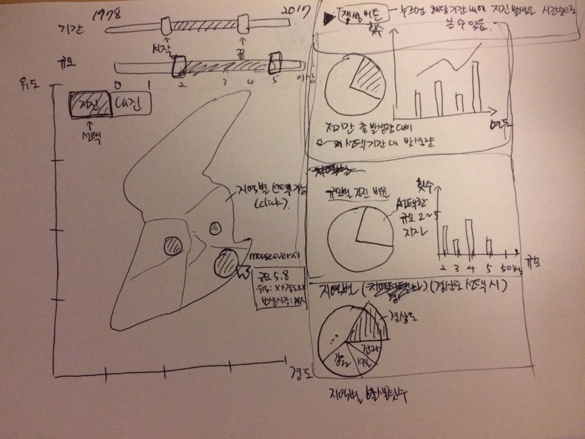
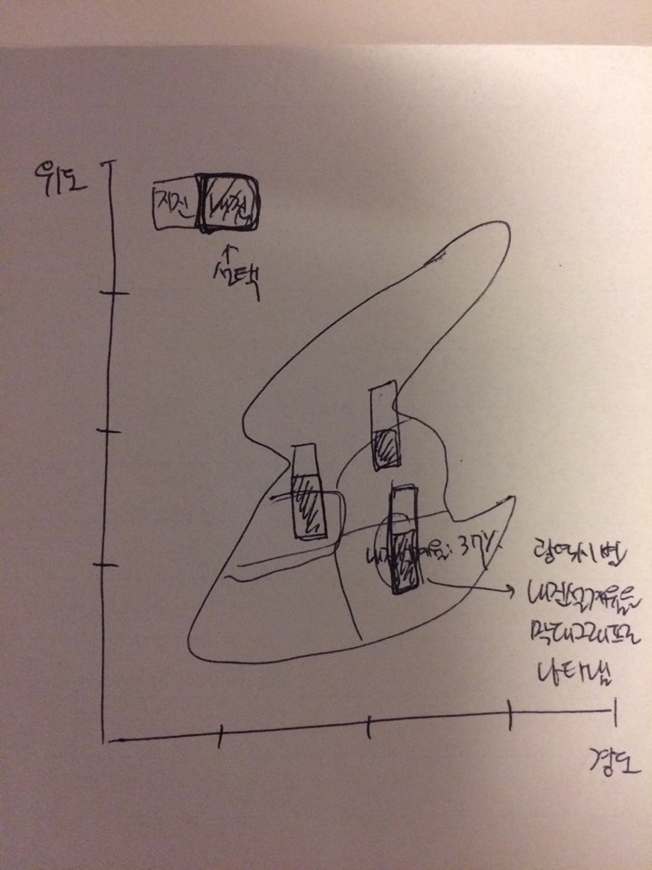

# HCI - Term Project 

## Team
* 권민혁 (Github ID: [mhkwon924](https://github.com/mhkwon924))
* 민두기 (Github ID: [bellatoris](https://github.com/bellatoris))

## Background
### 한국은 지진 안전 국가가 아니다.

대한민국의 연간 지진 발생 빈도와 그 규모가 최근 2 개년 동안 매우 높아지고 있다. 15 년도에 50 회 안팍이던 지진의 빈도가 16 년도에 250 회로 늘었고, 17 년도의 경우 아직 절반이 안 지났는 데도 70 회의 지진이 있었다. 또한 78 년도 부터 일어난 전체 지진을 규모로 순위를 매겨봤을 때, 13 년도 이후에 일어난 것이 10 위 안에 6 개나 포함되었고 그 중에서 절반이 16 년도에 일어난 것이었다.

그러나 한국의 건물 중 내진 설계가 된 건물은 6.5% 에 불과 한다는 점을 확인 하였다.

## Goal

최근 지진 발생 빈도와 규모를 추이를 한국은 더 이상 지진 안전 국가가 아니란 것을 확인 할 수 있다. 그러나 현재 존재하는 분석 자료는 그 추이와 경향성을 한눈에 알기가 힘들다. 그래서 우리는 좀 더 나은 data visualization 을 통해 지진의 발생 빈도와 규모의 추이와 경향성을 보여주어 사람들 에게 경각심을 주고자 한다.

## Data

기상청의 [지진 데이터](http://www.kma.go.kr/weather/earthquake_volcano/domesticlist.jsp) 사용

## Interface 

## Implementation Plan
| Todo | Due date|
|:----|:--------|
| 데이터 취합 및 plot | 5 / 13 |
| 기간 별, 규모 별 기능 구현| 5 / 27|
| 추가적 통계자료 들 구현 | 6 / 3 |
| 내진 설계 탭 구현 | 6 / 3 |